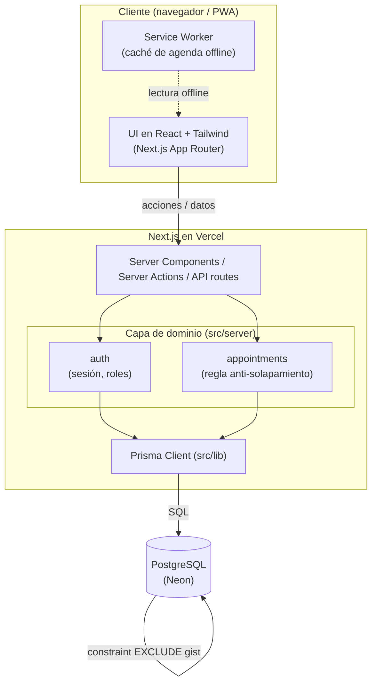

# Documentación Técnica / Arquitectura — ERP Diagnóstico

Describe la arquitectura del sistema, sus capas, el flujo de datos y las decisiones técnicas.

## 1. Visión general

Aplicación web **en la nube** construida con **Next.js (App Router)** y **PostgreSQL** vía **Prisma**. La app y la base de datos se despliegan en la nube (Vercel + Neon) para permitir **acceso remoto**, con una **PWA** que cachea la agenda para consulta offline.

## 2. Diagrama de componentes



## 3. Capas

| Capa | Responsabilidad | Ubicación |
|------|-----------------|-----------|
| **Presentación** | UI, formularios, calendario, navegación. | `src/app`, `src/components` |
| **Dominio / servicios** | Reglas de negocio (citas, disponibilidad, auth). Aislada y testeable. | `src/server` |
| **Acceso a datos** | Consultas y persistencia vía Prisma. | `src/lib` (cliente Prisma), `prisma/` |
| **Base de datos** | Almacenamiento e integridad (constraints). | PostgreSQL / Neon |

### Estructura de carpetas

```
src/
  app/            # Next.js App Router (rutas + UI, en español)
  server/         # Lógica de dominio
    appointments/ # validación anti-solapamiento (aislada, testeable)
    auth/
  lib/            # prisma client, guards de rol, utilidades
  components/     # UI reutilizable (Tailwind)
prisma/schema.prisma
tests/            # unit + integración
public/           # manifest PWA + service worker
```

## 4. Flujo de datos (crear cita)

1. El usuario envía el formulario desde la **UI**.
2. Una **Server Action / API route** recibe la petición y verifica **sesión y rol** (`auth`).
3. El servicio de **citas** (`appointments`) valida disponibilidad y **solapamiento (médico y consultorio/sala)**.
4. Si es válido, **Prisma** persiste la cita; la **constraint de exclusión** en la BD es la última línea de defensa ante concurrencia.
5. Se escribe un registro de **auditoría**.
6. La UI se actualiza (revalidación).

## 5. Decisiones técnicas

| Decisión | Justificación |
|----------|---------------|
| **Nube (Vercel + Neon)** | Se necesita acceso remoto desde otros ordenadores; una sola BD accesible con la cadena de conexión. |
| **PWA con caché de lectura** | Mitiga la inestabilidad de internet: permite consultar la agenda offline (crear/editar requiere conexión). |
| **Cero solapamientos en 2 capas** | Validación en servicio (UX) + constraints `EXCLUDE USING gist` en BD **por médico y por recurso** (integridad ante concurrencia). |
| **RBAC por rol** | Control de acceso simple y claro (ADMIN/RECEPCION/MEDICO). |
| **IDs `uuid`/`cuid`** | Evitan colisiones si se sincroniza o migra entre entornos. |
| **TypeScript + dominio aislado** | Mantenibilidad y tests de la lógica crítica sin depender de la UI. |
| **pnpm** | Gestor de paquetes rápido y eficiente en disco. |
| **Recordatorios automáticos** | Confirmación por **WhatsApp** (API de WhatsApp Business) disparada por una **tarea programada (cron)** **24 h antes**; se registra la respuesta. |
| **Duración por médico + servicio** | La duración de la cita no es global: sale de `DoctorServicio` (cada médico define su duración por servicio). |

## 6. Seguridad y privacidad

- Contraseñas con **hash** (argon2/bcrypt); nunca en texto plano.
- **Sesiones** seguras (cookie httpOnly).
- **Control de acceso** por rol en cada ruta/acción.
- **Auditoría** de accesos y cambios sobre datos médicos (HIPAA/GDPR).
- **Secretos** solo en variables de entorno (`.env`), nunca en el repositorio.

## 7. Despliegue

- **App:** Vercel (build de Next.js).
- **BD:** Neon (PostgreSQL serverless).
- **Variables de entorno:** `DATABASE_URL` y secretos de sesión configurados en Vercel.
- **Migraciones:** `pnpm prisma migrate deploy` en el pipeline de despliegue.

Ver también: [`ROADMAP.md`](ROADMAP.md) · [`MODELO-DATOS.md`](MODELO-DATOS.md) · [`FLUJO-USUARIO.md`](FLUJO-USUARIO.md).
