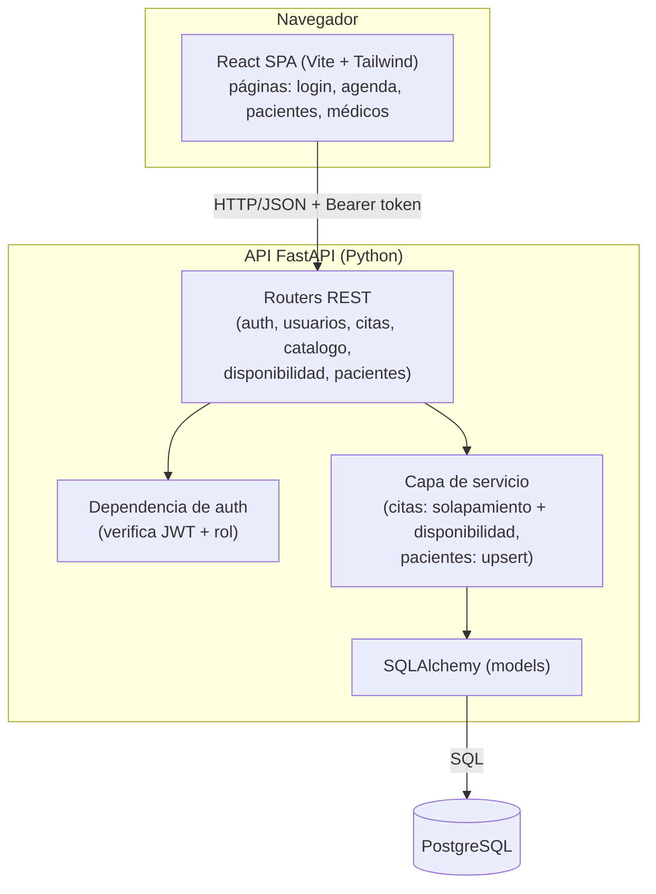

# Documentación Técnica / Arquitectura — ERP Diagnóstico

Describe la arquitectura del sistema, sus capas, el flujo de datos y las decisiones técnicas del **MVP**.

## 1. Visión general

Aplicación web de **dos piezas desacopladas**, en **dos repositorios separados**:

- **Frontend** — repo `diagnostico-frontend`: una **SPA en React** (Vite, JavaScript) que consume una API REST.
- **Backend** — repo `diagnostico-backend` (este): una **API REST en FastAPI** (Python) con **SQLAlchemy** sobre **PostgreSQL**, autenticación por **JWT** y toda la lógica de negocio (validación de citas, upsert de pacientes, disponibilidad). Aquí viven también los `docs/` y el `mockup/` del proyecto.

Se comunican por **HTTP/JSON**. El frontend guarda el token JWT y lo envía en la cabecera `Authorization` de cada petición.

## 2. Diagrama de componentes



## 3. Capas

| Capa | Responsabilidad | Ubicación |
|------|-----------------|-----------|
| **Presentación** | UI, formularios, calendario, navegación. Llamadas a la API. | frontend · `src/` |
| **API / controller** | Endpoints REST, validación de entrada (Pydantic), verificación de rol. | backend · `app/controller` |
| **Dominio / servicios** | Reglas de negocio (citas, disponibilidad, upsert de paciente, auth). Aislada y testeable. | backend · `app/services` |
| **Acceso a datos** | Modelos y consultas vía SQLAlchemy. | backend · `app/models`, `app/db.py` |
| **Base de datos** | Almacenamiento e integridad. | PostgreSQL |

### Estructura de carpetas

**Repo BACKEND** (`diagnostico-backend`, este repo):

```
app/
  main.py           # arranque FastAPI: solo monta el enrutador (controller)
  db.py             # engine + sesión SQLAlchemy (Base)
  auth.py           # JWT, hash de contraseñas, dependencias de rol
  enums/            # enums del dominio: Role, AppointmentStatus, ServiceCategory
  models/           # una tabla por archivo (usuario, cita, servicio, ...)
  schemas/          # esquemas Pydantic por dominio (auth, cita, catalogo, ...)
  controller/       # endpoints: auth, usuarios, citas, catalogo, disponibilidad, pacientes
  services/         # lógica: citas (solapamiento/disponibilidad), pacientes (upsert)
  seed.py           # datos base (catálogo, personal, cuadro médico)
alembic/            # migraciones
tests/              # pytest
requirements.txt · ruff.toml
docs/  mockup/       # documentación del proyecto
```

**Repo FRONTEND** (`diagnostico-frontend`):

```
src/
  api/              # cliente HTTP (fetch/axios) + guardado del token
  pages/            # login, agenda/calendario, pacientes, médicos
  components/       # UI reutilizable (Tailwind)
  App.jsx           # rutas (React Router) + guardas por rol
package.json        # pnpm
```

## 4. Flujo de datos (crear una cita)

1. Recepción rellena el formulario en la **SPA** y envía la petición con el **token JWT**.
2. El **router** de citas valida el cuerpo (Pydantic) y la **dependencia de auth** comprueba sesión y rol.
3. El **servicio de pacientes** hace el **upsert**: busca al paciente por `nombre_completo` + `edad`; si no existe, lo crea con `rol = PACIENTE`.
4. El **servicio de citas** calcula `ends_at` (según la duración elegida al agendar), valida que la hora cae **dentro de la disponibilidad** del médico y que **no se solapa** con otra cita activa del mismo médico.
5. Si es válido, **SQLAlchemy** persiste la cita y responde en JSON; la SPA refresca la agenda.

## 5. Decisiones técnicas

| Decisión | Justificación |
|----------|---------------|
| **Simplicidad primero** *(regla de oro)* | El código **lo más sencillo posible**: menos abstracciones y dependencias, funciones cortas y legibles, sin patrones innecesarios. Ante la duda, la opción simple. |
| **React (Vite) + FastAPI desacoplados** | Frontend y backend separados, cada uno simple; FastAPI da validación (Pydantic) y **Swagger** gratis en `/docs`. |
| **JavaScript (no TypeScript)** | El usuario no vio TS en el bootcamp; se prioriza simplicidad y lo conocido. |
| **SQLAlchemy (no Prisma)** | Es el ORM que se vio en el bootcamp; menos fricción. Migraciones con Alembic. |
| **Tabla `usuarios` unificada** | Personal, médicos y pacientes comparten diseño de tabla (campo `rol`) → menos código. Dos vistas UI (Pacientes/Médicos) que filtran por rol. |
| **JWT** | Encaje natural para SPA + API separadas; sin estado de sesión en el servidor. |
| **Validación en la capa de servicio** | Cero solapamientos (por médico) y disponibilidad se validan en Python antes de guardar, con mensaje claro. *(Constraint `gist` en BD → fase 2.)* |
| **Upsert de paciente al agendar** | Evita duplicados y agiliza el flujo real de recepción. |
| **IDs `uuid`** | Evitan colisiones al migrar entre entornos. |

## 6. Seguridad y privacidad

- Contraseñas con **hash** (bcrypt); nunca en texto plano.
- **JWT** firmado con secreto en variable de entorno; expiración razonable.
- **Control de acceso por rol** en cada endpoint (dependencia `require_role`): RECEPCIÓN no accede a usuarios, configuración ni reportes.
- **Secretos** solo en variables de entorno (`.env`), nunca en el repositorio.
- **Datos médicos** (HIPAA/GDPR): bajas lógicas (`activo`), sin borrado físico. *(Auditoría completa → fase 2.)*

## 7. Despliegue (orientativo)

- **Frontend:** build estático de Vite (Vercel / Netlify / cualquier hosting estático).
- **Backend:** servicio Python (Render / Railway / Fly.io).
- **BD:** PostgreSQL — Render gestionado en producción; Neon o local en desarrollo.
- **Variables de entorno:** `DATABASE_URL` y `JWT_SECRET`.
- **Migraciones:** `alembic upgrade head` en el despliegue.

Ver también: [`ROADMAP.md`](ROADMAP.md) · [`MODELO-DATOS.md`](MODELO-DATOS.md) · [`FLUJO-USUARIO.md`](FLUJO-USUARIO.md).
