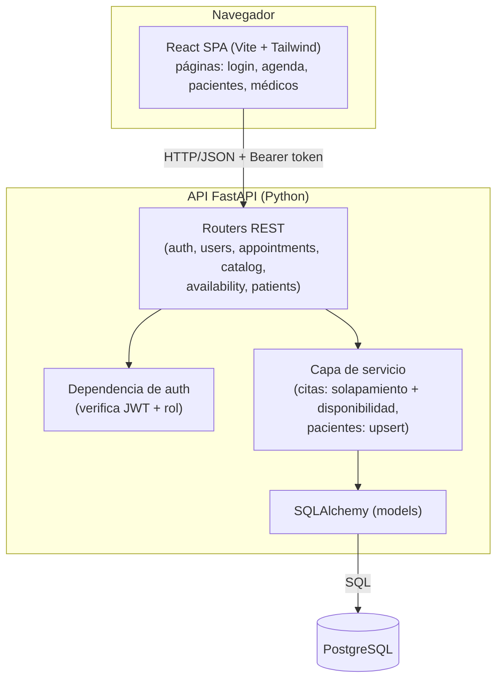

# Documentación Técnica / Arquitectura — ERP Diagnóstico

Describe la arquitectura del sistema, sus capas, el flujo de datos y las decisiones técnicas del **MVP**.

## 1. Visión general

Aplicación web de **dos piezas desacopladas**, en **dos repositorios separados**:

- **Frontend** — repo `diagnostico-frontend`: una **SPA en React** (Vite, JavaScript) que consume una API REST.
- **Backend** — repo `diagnostico-backend` (este): una **API REST en FastAPI** (Python) con **SQLAlchemy** sobre **PostgreSQL**, autenticación por **JWT** y toda la lógica de negocio (validación de citas, upsert de pacientes, disponibilidad). Aquí viven también los `docs/` y el `mockup/` del proyecto.

Se comunican por **HTTP/JSON**. El frontend guarda el token JWT y lo envía en la cabecera `Authorization` de cada petición.

## 2. Diagrama de componentes



## 3. Capas

| Capa | Responsabilidad | Ubicación |
|------|-----------------|-----------|
| **Presentación** | UI, formularios, calendario, navegación. Llamadas a la API. | frontend · `src/` |
| **API / controller** | Endpoints REST, validación de entrada (Pydantic), verificación de rol. | backend · `app/controller` |
| **Dominio / servicios** | Reglas de negocio (citas, disponibilidad, upsert de paciente, auth). Aislada y testeable. | backend · `app/services` |
| **Acceso a datos** | Modelos y consultas vía SQLAlchemy. | backend · `app/models`, `app/db.py` |
| **Base de datos** | Almacenamiento e integridad. | PostgreSQL |

### Estructura de carpetas

**Repo BACKEND** (`diagnostico-backend`, este repo):

```
app/
  main.py           # arranque FastAPI: solo monta el enrutador (controller)
  db.py             # engine + sesión SQLAlchemy (Base)
  auth.py           # JWT, hash de contraseñas, dependencias de rol
  enums/            # enums del dominio: Role, AppointmentStatus, ServiceCategory
  models/           # una tabla por archivo (usuario, cita, servicio, ...)
  schemas/          # esquemas Pydantic por dominio (auth, cita, catalogo, ...)
  controller/       # endpoints: auth, usuarios, citas, catalogo, disponibilidad, pacientes
  services/         # lógica: citas (solapamiento/disponibilidad), pacientes (upsert)
  seed.py           # datos base (catálogo, personal, cuadro médico)
alembic/            # migraciones
tests/              # pytest
requirements.txt · ruff.toml
docs/  mockup/       # documentación del proyecto
```

**Repo FRONTEND** (`diagnostico-frontend`):

```
src/
  api/              # cliente HTTP (fetch/axios) + guardado del token
  pages/            # login, agenda/calendario, pacientes, médicos
  components/       # UI reutilizable (Tailwind)
  App.jsx           # rutas (React Router) + guardas por rol
package.json        # pnpm
```

## 4. Flujo de datos (crear una cita)

1. Recepción rellena el formulario en la **SPA** y envía la petición con el **token JWT**.
2. El **router** de citas valida el cuerpo (Pydantic) y la **dependencia de auth** comprueba sesión y rol.
3. El **servicio de pacientes** hace el **upsert**: busca al paciente por `nombre_completo` + `edad`; si no existe, lo crea con `rol = PACIENTE`.
4. El **servicio de citas** calcula `ends_at` (según la duración elegida al agendar), valida que la hora cae **dentro de la disponibilidad** del médico y que **no se solapa** con otra cita activa del mismo médico.
5. Si es válido, **SQLAlchemy** persiste la cita y responde en JSON; la SPA refresca la agenda.

## 5. Decisiones técnicas

| Decisión | Justificación |
|----------|---------------|
| **Simplicidad primero** *(regla de oro)* | El código **lo más sencillo posible**: menos abstracciones y dependencias, funciones cortas y legibles, sin patrones innecesarios. Ante la duda, la opción simple. |
| **React (Vite) + FastAPI desacoplados** | Frontend y backend separados, cada uno simple; FastAPI da validación (Pydantic) y **Swagger** gratis en `/docs`. |
| **JavaScript (no TypeScript)** | El usuario no vio TS en el bootcamp; se prioriza simplicidad y lo conocido. |
| **SQLAlchemy (no Prisma)** | Es el ORM que se vio en el bootcamp; menos fricción. Migraciones con Alembic. |
| **Tabla `usuarios` unificada** | Personal, médicos y pacientes comparten diseño de tabla (campo `rol`) → menos código. Dos vistas UI (Pacientes/Médicos) que filtran por rol. |
| **JWT** | Encaje natural para SPA + API separadas; sin estado de sesión en el servidor. |
| **Validación en la capa de servicio, con red en la BD** | Cero solapamientos y disponibilidad se validan en Python antes de guardar, con mensaje claro. Además la tabla `citas` lleva una restricción `EXCLUDE USING gist` que impide el solape aunque se escriba por fuera de la aplicación. |
| **Upsert de paciente al agendar** | Evita duplicados y agiliza el flujo real de recepción. |
| **IDs `uuid`** | Evitan colisiones al migrar entre entornos. |

## 5.b Principios y patrones de diseño

**Principios**
- **KISS / Simplicidad primero** — menos abstracciones, funciones cortas, sin patrones innecesarios.
- **Separación de responsabilidades (SRP)** — cada capa y cada módulo hacen una sola cosa.
- **DRY** — la lógica repetida se centraliza (ej. `value_in_use` para unicidad; helpers `_validate_*`).

**Patrones**
| Patrón | Dónde / cómo |
|--------|--------------|
| **Arquitectura en capas** | `controller/` (HTTP) → `services/` (negocio) → SQLAlchemy (datos). |
| **Service Layer** | Toda la lógica de negocio en `app/services/`, testeable sin levantar la API. |
| **Inyección de dependencias** | `Depends()` de FastAPI: `get_db`, `current_user`, `require_role`. |
| **Factory de dependencias** | `require_role(*roles)` devuelve una dependencia que valida el rol del usuario. |
| **DTO / esquemas de frontera** | Pydantic (`app/schemas/`) valida la entrada y serializa la salida; el modelo ORM no se expone directo. |
| **Excepciones de dominio → HTTP** | Los servicios lanzan excepciones propias; el router las traduce a 400/404/409. |
| **Unit of Work** | Una transacción por petición: los servicios hacen `flush`, el endpoint hace `commit`. |
| **Tabla de asociación N:M** | `usuario_especialidad`, `servicio_especialidad`. |
| **Soft delete (baja lógica)** | `activo = False` en vez de borrar, para personal y servicios (conserva el histórico). **Los pacientes no**: ver R10. |
| **Upsert** | `find_or_create_patient` evita duplicados al agendar. |
| **Enums de dominio** | Listas cerradas (`Role`, `AppointmentStatus`, `ServiceCategory`) validadas por Pydantic y la BD. |

## 6. La capa de servicios en detalle

> `app/services/` concentra **toda** la lógica de negocio. Los routers solo validan el HTTP,
> delegan en el servicio y traducen las excepciones de dominio a códigos HTTP. Por eso la lógica
> se puede **probar sin levantar la API**.

**Reglas comunes a todos los servicios:**

- **Sin dependencia de FastAPI:** reciben una `Session` de SQLAlchemy y datos simples; no conocen `Request` ni `Response`.
- **`flush`, no `commit`:** los servicios hacen `db.flush()` (asignan ids, validan restricciones) pero **no confirman**. El `commit` lo hace el endpoint, para que toda la petición sea una única transacción.
- **Excepciones de dominio:** cada regla que falla lanza una excepción propia (ej. `Overlap`, `PatientNotFound`). El router la captura y devuelve el código correcto. **El servicio nunca decide el HTTP.**
- **Baja lógica:** desactivar ≠ borrar. `activo = False` conserva el histórico. La excepción son los **pacientes**, cuyo borrado sí elimina sus datos personales (R10).

### `appointments.py` — núcleo de las citas

| Función | Qué hace |
|---------|----------|
| `create_appointment(...)` | Orquesta el alta: valida servicio/médico/rejilla → no-pasado → upsert del paciente → calcula `ends_at` → valida disponibilidad y anti-solapamiento. |
| `edit_appointment(...)` | Edita/mueve una cita activa (parcial), revalidando las mismas reglas y **excluyéndose a sí misma** del anti-solapamiento. |
| `get_appointment(...)` | Una cita por id, sea cual sea su estado. |
| `cancel_appointment(...)` | Pasa la cita a `CANCELLED` (libera el cupo). Solo sobre citas activas. |
| `mark_attendance(...)` | Marca `COMPLETED` o `NO_SHOW`. Solo sobre citas activas. |
| `list_appointments(...)` | Agenda por día o rango `[desde, hasta]`, filtrable por médico. |
| `list_patient_appointments(...)` | Historial completo de un paciente. |

**Helpers:** `is_aligned` (rejilla :00/:15/:30/:45), `calculate_ends_at`, `within_availability`, `has_overlap`, `now_center` (hora del centro, UTC−4).

**Excepciones → HTTP:** `ServiceNotFound`/`DoctorNotFound`/`AppointmentNotFound` → 404 · `TimeNotAligned`/`AppointmentInThePast`/`OutsideAvailability` → 400 · `Overlap`/`AppointmentNotCancellable`/`AppointmentNotActive`/`AppointmentNotEditable` → 409.

### `patients.py` — pacientes (CRUD + upsert al agendar)

| Función | Qué hace |
|---------|----------|
| `find_or_create_patient(nombre, edad)` | **Upsert:** busca por `nombre_completo` + `edad`; lo reutiliza, lo crea, o lanza `AmbiguousPatients` si hay varios. |
| `list_patients` / `get_patient` | Listado (solo activos) y ficha por id. |
| `create_patient` / `update_patient` | Alta manual y edición parcial; cédula única. |
| `erase_patient` | Borra sus datos personales **para siempre**: elimina la fila si no tiene citas, o la anonimiza si las tiene (R10). |

**Excepciones:** `PatientNotFound` → 404 · `AmbiguousPatients` → 409 (devuelve los candidatos) · `DuplicateNationalId` → 409.

### `catalog.py` — servicios, especialidades y médicos

| Función | Qué hace |
|---------|----------|
| `list_services(medico_id=None)` | Servicios activos; con `medico_id`, **solo los de las especialidades de ese médico**. |
| `list_doctors` / `list_specialties` | Médicos activos con sus especialidades; catálogo de especialidades. |
| `create_service` / `update_service` | Alta y edición; la edición incluye **qué especialidades ofrecen el servicio**, que es lo que alimenta el filtro por médico. |
| `deactivate_service` | Baja lógica; nunca se borra, porque hay citas que lo referencian. |
| `create_specialty` / `update_specialty` | Alta y renombrado. |
| `delete_specialty` | Borrado real, **bloqueado si algún médico o servicio la usa** (R9). |
| `resolve_specialties(ids)` | Convierte ids en especialidades; lo comparten catálogo y usuarios. |

**Excepciones:** `ServiceNotFound`/`SpecialtyNotFound` → 404 · `DuplicateName` → 409 · `SpecialtyInUse` → 409 (lleva cuántos médicos y servicios la usan).

### `users.py` — personal que hace login (CRUD, solo ADMIN)

Gestiona ADMIN/RECEPCION/MEDICO. Los pacientes **no** se gestionan aquí.

| Función | Qué hace |
|---------|----------|
| `list_staff` / `get_user` | Todo el personal (excluye pacientes) y ficha por id. |
| `create_user` | Alta con contraseña **hasheada** (bcrypt); el rol no puede ser `PACIENTE`; resuelve especialidades. |
| `update_user` | Edición parcial; **no permite cambiar el rol**; rehashea si cambia la contraseña. |
| `deactivate_user` | Baja lógica. |

**Excepciones:** `UserNotFound` → 404 · `DuplicateEmail` → 409 · `RoleNotAllowed`/`DoctorOnlyData` → 422.

### `availability.py` — franjas semanales del médico

| Función | Qué hace |
|---------|----------|
| `list_availability(medico_id)` | Franjas de un médico, ordenadas. |
| `create_availability(...)` | Alta; valida médico, `hora_inicio < hora_fin` y que no se cruce con otra franja suya ese día (R7). |
| `update_availability(...)` | Edición parcial (no cambia de médico); revalida R7 excluyendo la propia franja y comprueba R8. |
| `delete_availability(...)` | Elimina una franja, salvo que sostenga citas activas futuras (R8). |
| `_covered_appointments(...)` | Citas que una franja sostiene. Es exacto **porque** R7 garantiza que cada cita la cubre una sola franja. |

**Excepciones:** `DoctorNotFound`/`SlotNotFound` → 404 · `InvalidSlot` → 400 · `OverlappingSlot` → 409 · `StrandedAppointments` → 409 (lleva el número de citas afectadas).

### `common.py` — utilidad compartida

`value_in_use(...)` centraliza el patrón de **unicidad** (email, cédula, nombres), comparando **sin distinguir mayúsculas ni acentos** y excluyendo la propia fila al editar.

### Cómo se conecta con el router

```
Router (async)  →  Servicio (lógica)  →  SQLAlchemy (flush)
     │                     │
     │  captura la         │  lanza excepción
     │  excepción y        │  de dominio si
     ▼  devuelve HTTP      ▼  una regla falla
  404/400/409          Overlap, PatientNotFound…
```

El router hace el `db.commit()` final si todo ha ido bien.

## 7. Seguridad y privacidad

- Contraseñas con **hash** (bcrypt); nunca en texto plano.
- **JWT** firmado con secreto en variable de entorno; expiración razonable.
- **Control de acceso por rol** en cada endpoint (dependencia `require_role`): RECEPCIÓN no accede a usuarios, configuración ni reportes.
- **Secretos** solo en variables de entorno (`.env`), nunca en el repositorio.
- **Datos del paciente:** cuando pide que le borren, se le borran de verdad (R10); lo que se conserva es la cita, ya sin identificar. Personal y servicios sí usan baja lógica, porque ahí el motivo es otro: dejar de operar sin perder el histórico. *(Auditoría completa → fase 2.)*

## 8. Despliegue

Tres piezas en tres proveedores, todas en plan gratuito:

- **Frontend:** build estático de Vite en **Vercel**.
- **Backend:** servicio Python en **Render** (se duerme a los 15 min sin tráfico).
- **BD:** PostgreSQL en **Neon** (plan gratuito permanente).
- **Variables de entorno:** `DATABASE_URL`, `JWT_SECRET`, `ADMIN_PASSWORD` y `FRONTEND_ORIGINS`.
- **Migraciones:** `alembic upgrade head` en cada despliegue.

Detalle completo en [`DESPLIEGUE.md`](DESPLIEGUE.md).

Ver también: [`MODELO-DATOS.md`](MODELO-DATOS.md) · [`REGLAS-DE-NEGOCIO.md`](REGLAS-DE-NEGOCIO.md) · [`MANUAL-USUARIO.md`](MANUAL-USUARIO.md).
