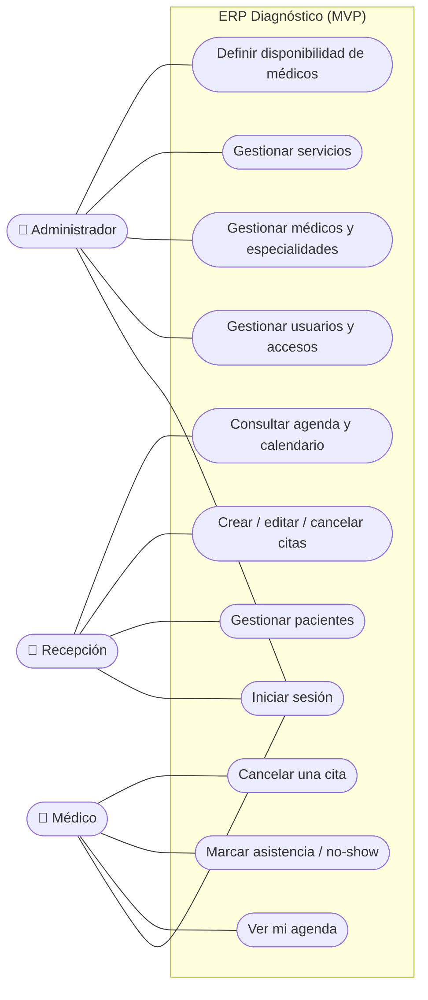

# Casos de Uso — ERP Diagnóstico

Actores del sistema y las acciones que puede realizar cada uno (alcance **MVP**). Diagrama en Mermaid (se renderiza en GitHub).

## Diagrama de casos de uso

> La **historia clínica** (notas del médico) queda **fuera del MVP → fase 2**; en el MVP el médico solo consulta su agenda.

> Recepción **no** accede a usuarios, configuración ni reportes.

## Descripción de casos de uso

| Caso de uso | Actor | Descripción |
|-------------|-------|-------------|
| CU-01 Iniciar sesión | Todos | Autenticarse con email y contraseña (JWT); el sistema aplica permisos según el rol. |
| CU-02 Gestionar usuarios | Admin | Crear, editar y desactivar cuentas del personal y asignar roles. |
| CU-03 Gestionar médicos y especialidades | Admin | Alta de médicos, asignación de una o varias especialidades (N:M). |
| CU-04 Definir disponibilidad | Admin | Configurar las franjas horarias en que atiende cada médico. |
| CU-05 Gestionar servicios | Admin | Definir los servicios del catálogo (consultas/estudios). |
| CU-06 Gestionar pacientes | Recepción | Registrar y editar pacientes (cédula única si se indica; opcional). |
| CU-07 Gestionar citas | Recepción | Crear, editar, mover y cancelar citas con validación anti-solapamiento **por médico** y **upsert de paciente**. |
| CU-08 Consultar agenda | Recepción | Ver la agenda del día y el calendario de los médicos (también desde el móvil). |
| CU-09 Ver mi agenda | Médico | Consultar sus propias citas. |
| CU-10 Marcar asistencia | Médico | Marcar una cita como atendida o no-show. |
| CU-10b Cancelar cita | Médico | Cancelar una de sus citas (libera el cupo). |
| CU-11 Historia clínica *(fase 2, fuera del MVP)* | Médico | Consultar y añadir notas de evolución del paciente. En el MVP no está disponible. |

## Caso de uso detallado: CU-07 Agendar cita

- **Actor:** Recepción (o Admin)
- **Precondición:** sesión iniciada con rol RECEPCION o ADMIN.
- **Flujo:** ver el diagrama en [`FLUJO-USUARIO.md`](FLUJO-USUARIO.md) (subflujo "crear cita"). Se elige médico y servicio; la duración la elige recepción (15/30/45/60/90 min); se introduce/busca al paciente (**upsert**).
- **Flujo alternativo:** si la hora está fuera de la **disponibilidad** del médico o **se solapa** con otra cita del mismo médico, el sistema avisa y no guarda.
- **Postcondición:** la cita queda agendada (`SCHEDULED`).

> **Fase 2:** agendar varios estudios en un paso (visita), recursos/salas, recordatorios WhatsApp, reportes y auditoría.
