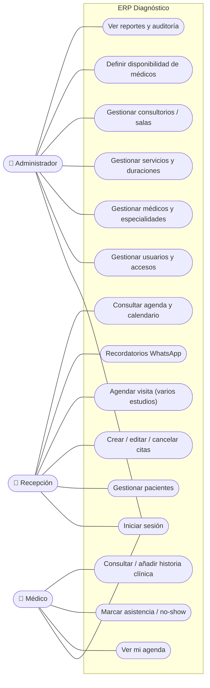

# Casos de Uso — ERP Diagnóstico

Actores del sistema y las acciones que puede realizar cada uno. Diagrama en Mermaid (se renderiza en GitHub).

## Diagrama de casos de uso

## Descripción de casos de uso

| Caso de uso | Actor | Descripción |
|-------------|-------|-------------|
| CU-01 Iniciar sesión | Todos | Autenticarse con email y contraseña; el sistema aplica permisos según el rol. |
| CU-02 Gestionar usuarios | Admin | Crear, editar y desactivar cuentas del personal y asignar roles. |
| CU-03 Gestionar médicos y especialidades | Admin | Alta de médicos, asignación de una o varias especialidades. |
| CU-04 Definir disponibilidad | Admin | Configurar las franjas horarias en que atiende cada médico. |
| CU-05 Gestionar servicios y duraciones | Admin | Definir servicios (consultas/estudios) y la **duración por médico + servicio**. |
| CU-05b Gestionar consultorios/salas | Admin | Alta de consultorios, salas y equipos de uso único (ecógrafo, endoscopio). |
| CU-06 Ver reportes y auditoría | Admin | Consultar reportes (volumen de citas, demanda por servicio, ocupación por médico) y el registro de auditoría. |
| CU-07 Gestionar pacientes | Recepción | Registrar y editar pacientes (cédula única si se indica; opcional). |
| CU-08 Gestionar citas | Recepción | Crear, editar, mover y cancelar citas con validación anti-solapamiento (médico y consultorio/sala). |
| CU-09 Agendar visita | Recepción | Agendar en un paso **varios estudios** del paciente para el mismo día. |
| CU-10 Recordatorios WhatsApp | Recepción / Sistema | El sistema envía **automáticamente** la confirmación el día antes; recepción supervisa las respuestas. |
| CU-11 Consultar agenda | Recepción | Ver la agenda del día y el calendario de todos los médicos (también desde el móvil). |
| CU-12 Ver mi agenda | Médico | Consultar sus propias citas. |
| CU-13 Marcar asistencia | Médico | Marcar una cita como atendida o no-show. |
| CU-14 Historia clínica | Médico | Consultar y añadir notas de evolución del paciente (reconsultas). |

## Caso de uso detallado: CU-08 / CU-09 Agendar visita

- **Actor:** Recepción (o Admin)
- **Precondición:** sesión iniciada con rol RECEPCION o ADMIN.
- **Flujo:** ver el diagrama en [`FLUJO-USUARIO.md`](FLUJO-USUARIO.md) (subflujo "crear cita/visita"). Se seleccionan uno o varios servicios (con su médico y su consultorio/sala); la duración sale de `DoctorServicio`.
- **Flujo alternativo:** si hay solapamiento del **médico o del consultorio/sala/equipo**, o está fuera de disponibilidad, el sistema avisa y no guarda esa cita.
- **Postcondición:** la visita y sus citas quedan agendadas (`SCHEDULED`), con recordatorio programado y registro en auditoría.
