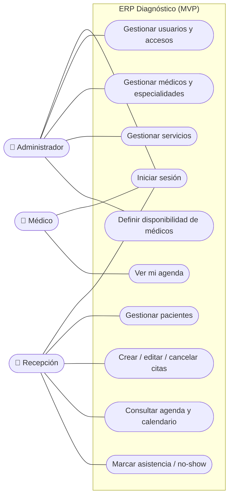

# Documentación Funcional — ERP Diagnóstico

Qué hace el sistema, para quién y bajo qué reglas (alcance **MVP**, deadline 2 semanas). Basado en los requisitos reales del centro. Complementa `ROADMAP.md` (plan) y `MODELO-DATOS.md` (datos).

## 1. Objetivo

Dar al centro **Diagnóstico** una herramienta para **gestionar citas médicas** de forma organizada: login por roles, evitar solapamientos, centralizar los pacientes (hoy dispersos en los contactos del teléfono) y ver la agenda de cada médico respetando su disponibilidad.

**Datos del centro:** una sola sede · ~60 citas/día · 18 médicos · 12 especialidades · consultas + ecografías + estudios cardíacos.

## 2. Alcance

**Incluye (MVP):**
1. **Autenticación con roles** (ADMIN, RECEPCION, MEDICO) mediante login (JWT).
2. Gestión de **usuarios/médicos** (ADMIN): médicos con **especialidades (N:M)** y **disponibilidad** semanal.
3. Gestión de **pacientes** (cédula única si se indica; opcional) con **alta automática al agendar** (upsert).
4. Catálogo de **servicios** (consultas y estudios).
5. Gestión de **citas** con **anti-solapamiento por médico** y **bloqueo por disponibilidad** del médico.
6. **Calendario / agenda** del día por médico.

**Fuera del alcance (→ fase 2):** historia clínica, reportes, recordatorios, auditoría, recursos/salas, portal de pacientes y más — lista completa en [`MEJORAS-Y-PROXIMOS-PASOS.md`](MEJORAS-Y-PROXIMOS-PASOS.md). La **facturación y cobros** quedan **fuera del sistema** (máquinas fiscales del SENIAT; solo pago directo, sin seguros).

## 3. Usuarios y roles

Personal, médicos y pacientes se guardan en **la misma tabla `usuarios`** (campo `rol`); en la UI hay **dos vistas separadas** —**Pacientes** y **Médicos**— que filtran por rol. Solo el personal interno hace login.

| Role | Permisos |
|-----|----------|
| **ADMIN** | **Todo**: usuarios, médicos, especialidades, servicios, configuración. |
| **RECEPCION** | Agenda y cancela citas; marca asistencia (atendida/no-show); gestiona pacientes; **consulta** médicos y agendas. **No** accede a **usuarios**, **configuración** ni **reportes**. |
| **MEDICO** | Ve su agenda (**solo lectura**). **No** cancela ni marca asistencia (lo hace recepción/admin). *(Las notas de historia clínica quedan para fase 2.)* |

> Los **pacientes no acceden** al sistema (son registros que gestiona recepción).

## 4. Requisitos funcionales (RF)

| ID | Requisito |
|----|-----------|
| RF-01 | Login con email/contraseña (JWT) y permisos por rol. |
| RF-02 | ADMIN gestiona usuarios, médicos, especialidades y servicios. |
| RF-03 | RECEPCION **no** puede acceder a usuarios, configuración ni reportes. |
| RF-04 | Cada médico define sus **especialidades (N:M)** y su **disponibilidad** semanal. |
| RF-05 | RECEPCION registra **pacientes** con **nombre completo y edad**; la **cédula** es **opcional** (la añaden los especialistas al hacer la consulta/estudio). |
| RF-06 | Al **agendar**, el sistema **detecta** al paciente por **nombre completo + edad** (o lo **crea** si no existe, upsert); si hay varias coincidencias, recepción **elige**. |
| RF-07 | RECEPCION crea, edita, mueve y cancela **citas**. |
| RF-08 | El sistema **impide solapar** dos citas activas del **mismo médico**. |
| RF-09 | La duración/fin de la cita se calcula con la **duración que elige recepción** al agendar (15/30/45/60/90 min). |
| RF-10 | El **calendario bloquea** los días/horas fuera de la **disponibilidad** del médico, **salvo que recepción fuerce un cupo extra** (sobrecupo) con confirmación. |
| RF-11 | Al **cancelar** una cita, su cupo queda libre. |
| RF-12 | El MEDICO ve su agenda (**solo lectura**). La asistencia (**atendida / no-show**) la marca RECEPCION/ADMIN. |
| RF-13 | *(Fase 2, fuera del MVP)* El MEDICO consultará y añadirá **notas de historia clínica** del paciente. |

## 5. Requisitos no funcionales (RNF)

| ID | Requisito |
|----|-----------|
| RNF-01 | Seguridad: contraseñas con **hash (bcrypt)**, **JWT**, control de acceso por rol. |
| RNF-02 | Privacidad HIPAA/GDPR: sin credenciales hardcodeadas; bajas lógicas (sin borrado físico). |
| RNF-03 | Integridad: cero solapamientos garantizado en la capa de servicio del backend. |
| RNF-04 | Rendimiento: soportar el volumen diario (~60 citas/día) con fluidez. |
| RNF-05 | Usabilidad: interfaz en **español**, clara y **responsive** (uso frecuente desde el móvil). |
| RNF-06 | Mantenibilidad: **Python/FastAPI + React**, código simple, dominio (validaciones) aislado y testeado. |

## 6. Historias de usuario

**Recepción**
- *Quiero registrar al paciente rápido con nombre completo y edad (la cédula se añade luego).*
- *Quiero que, al agendar, si el paciente ya existe se detecte solo y si no, se cree.*
- *Quiero que el sistema me avise si el horario del médico está ocupado o fuera de su disponibilidad, para no solapar.*

**Médico**
- *Quiero ver mi agenda del día (solo consulta).*
- *(Fase 2) Quiero revisar y añadir notas a la historia del paciente.*

**Administrador**
- *Quiero crear accesos para el personal y dar de alta médicos con sus especialidades y disponibilidad.*
- *Quiero mantener el catálogo de servicios.*

## 7. Reglas de negocio

| ID | Regla |
|----|-------|
| RN-01 | **Cero solapamientos por médico**: dos citas activas del mismo médico no pueden intersectar en el tiempo. |
| RN-02 | La **duración** de la cita la **elige recepción** al agendar, de una lista fija (15/30/45/60/90 min). |
| RN-03 | La **cédula** es **opcional** (única si se indica); los especialistas la añaden **después** del agendado, para el informe. |
| RN-04 | Un médico puede tener **varias especialidades** (N:M). |
| RN-05 | Al **agendar** se hace **upsert** del paciente por **nombre completo + edad** (detectar o crear; si hay varios, recepción elige). |
| RN-06 | Se agenda dentro de la **disponibilidad** del médico; recepción puede **forzar un cupo extra** (sobrecupo) de mutuo acuerdo. |
| RN-07 | Bajas **lógicas** (`activo`), nunca borrado físico. |
| RN-08 | Estados de cita: `SCHEDULED` · `CONFIRMED` · `CANCELLED` · `COMPLETED` · `NO_SHOW`. |
| RN-09 | Al **cancelar** una cita, su hueco queda libre (sale de los estados activos) y puede reutilizarse. |

## 8. Flujo principal: crear una cita

El recorrido completo, con sus diagramas, está en [`MANUAL-USUARIO.md`](MANUAL-USUARIO.md). En resumen: **login** → elegir médico y servicio → el calendario muestra los días/horas **disponibles** (recepción puede forzar un **sobrecupo**) → introducir al paciente por **nombre completo + edad** (**upsert**) → el sistema calcula el fin con la **duración elegida** y **valida el solapamiento por médico** → guardar la cita.

## 9. Casos de uso

Actores del sistema y las acciones que puede realizar cada uno (alcance **MVP**).

| Caso de uso | Actor | Descripción |
|-------------|-------|-------------|
| CU-01 Iniciar sesión | Todos | Autenticarse con email y contraseña (JWT); el sistema aplica permisos según el rol. |
| CU-02 Gestionar usuarios | Admin | Crear, editar y desactivar cuentas del personal y asignar roles. |
| CU-03 Gestionar médicos y especialidades | Admin | Alta de médicos, asignación de una o varias especialidades (N:M). |
| CU-04 Definir disponibilidad | Admin | Configurar las franjas horarias en que atiende cada médico. |
| CU-05 Gestionar servicios | Admin | Definir los servicios del catálogo (consultas/estudios). |
| CU-06 Gestionar pacientes | Recepción | Registrar y editar pacientes (cédula única si se indica; opcional). |
| CU-07 Gestionar citas | Recepción | Crear, editar, mover y cancelar citas con validación anti-solapamiento **por médico** y **upsert de paciente**. |
| CU-08 Consultar agenda | Recepción | Ver la agenda del día y el calendario de los médicos (también desde el móvil). |
| CU-09 Ver mi agenda | Médico | Consultar sus propias citas (**solo lectura**). |
| CU-10 Marcar asistencia | Recepción | Marcar una cita como atendida o no-show. |
| CU-11 Historia clínica *(fase 2, fuera del MVP)* | Médico | Consultar y añadir notas de evolución del paciente. En el MVP no está disponible. |

> El flujo detallado de **CU-07 (agendar cita)** está en el §8 anterior y en los diagramas de [`MANUAL-USUARIO.md`](MANUAL-USUARIO.md).
