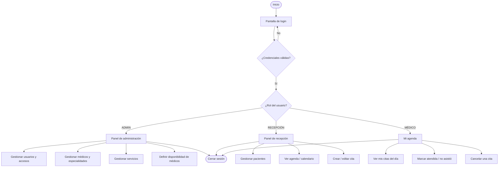
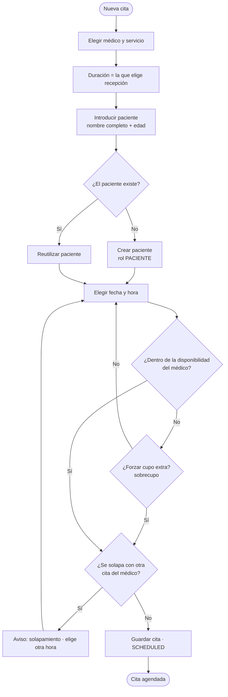

# Flujo de Usuario — ERP Diagnóstico

Diagrama de flujo (flowchart) del recorrido del personal en el sistema, según su rol (alcance **MVP**). Se renderiza automáticamente en GitHub (Mermaid).

## Flujo general por rol

> Recepción **no** ve gestión de usuarios, configuración ni reportes.

## Subflujo: crear una cita (upsert de paciente + cero solapamientos)

## Notas

- La validación (disponibilidad del médico + **cero solapamientos por médico**) y el **upsert de paciente** se ejecutan en la **capa de servicio** del backend (FastAPI) antes de guardar.
- El calendario **bloquea** (grisa) los días/horas fuera de la disponibilidad del médico; recepción puede **forzar un cupo extra** (sobrecupo) con confirmación.
- Los pacientes **no acceden** al sistema; toda gestión la realiza el personal.
- **Fase 2:** historia clínica (notas del médico), anti-solapamiento por recurso/sala, agrupar varios estudios (visita), recordatorios WhatsApp, auditoría y refuerzo con restricciones a nivel de base de datos.
