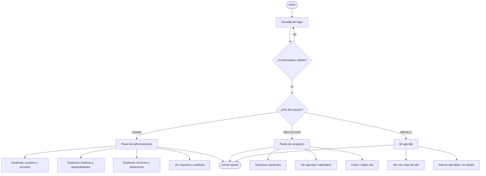
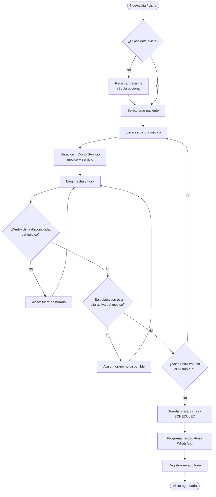

# Flujo de Usuario — ERP Diagnóstico

Diagrama de flujo (flowchart) del recorrido del personal en el sistema, según su rol. Se renderiza automáticamente en GitHub (Mermaid).

## Flujo general por rol

## Subflujo: crear una cita / visita (regla de cero solapamientos)

## Notas

- La validación de solapamiento se ejecuta en la **capa de servicio** y se refuerza con una restricción a nivel de **base de datos** (ver `MODELO-DATOS.md`).
- Los pacientes **no acceden** al sistema; toda gestión la realiza el personal.
- Toda acción sobre datos médicos queda registrada en **auditoría** (requisito HIPAA/GDPR).
