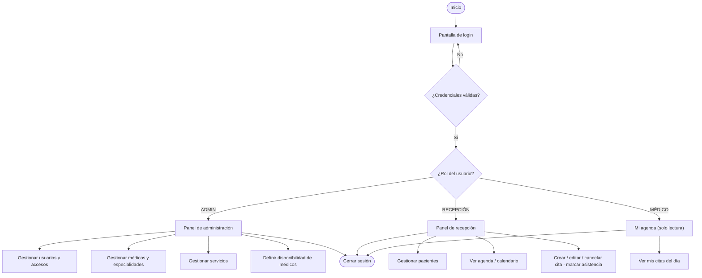
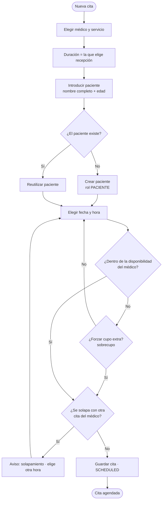

# Manual de Usuario — ERP Diagnóstico

Guía de uso del sistema para el personal del centro (alcance **MVP**). La interfaz está en español.

> Nota: las pantallas de referencia están en el prototipo visual (`mockup/index.html`).

## 1. Iniciar sesión

1. Abre la aplicación en el navegador.
2. Introduce tu **correo** y **contraseña**.
3. Pulsa **Entrar**. Verás un panel distinto según tu rol.

## 2. El panel según tu rol

- **Administrador:** acceso a todo — usuarios, médicos, especialidades y servicios.
- **Recepción:** pacientes, agenda y citas. **No** ve usuarios, configuración ni reportes.
- **Médico:** tu agenda del día (**solo lectura**). **Consultas** tus citas, pero **no** creas, editas, cancelas ni marcas asistencia (de eso se encarga recepción); las notas clínicas llegan en fase 2.

### El recorrido de un vistazo

## 3. Agendar una cita (Recepción / Admin)

1. Pulsa **Nueva cita** (botón superior).
2. **Médico, servicio y duración:** elige el médico, el servicio (consulta o estudio) y la **duración** de la cita (15, 30, 45, 60 o 90 min).
3. **Paciente:** escribe su **nombre completo** y su **edad**. Si ya existe, el sistema lo **detecta**; si no, lo **crea** automáticamente al guardar. La **cédula** es opcional y se añade después.
4. **Fecha y hora:** el calendario muestra solo los **días/horas disponibles** del médico. Si el médico ya está ocupado a esa hora, el sistema **avisa** y no deja guardar; elige otro hueco.
5. Pulsa **Guardar**. La cita queda como **agendada**.

Paso a paso, esto es lo que hace el sistema por dentro:

Si el mismo nombre y edad coinciden con **varios** pacientes, el sistema no adivina: te muestra los candidatos para que elijas cuál es.

## 4. Editar, mover, cancelar o marcar asistencia (Recepción / Admin)

1. Abre la cita desde la **agenda** o el **calendario**.
2. Cambia los datos (fecha, hora, servicio…) o pulsa **Cancelar cita**.
3. Al mover una cita, se vuelve a validar que no haya solapamiento. Al **cancelar**, su hueco queda libre.
4. Tras la consulta, marca la cita como **Atendida** o **No asistió** (asistencia / no-show).

## 5. Gestionar pacientes (Recepción / Admin)

1. Entra en **Pacientes**.
2. **Nuevo paciente:** rellena **nombre completo** y **edad**; la **cédula** (única; no la tienen niños ni extranjeros), la **fecha de nacimiento** y el **teléfono** son **opcionales**.
3. Desde la **ficha** del paciente puedes ver su historial de citas.
4. **Eliminar un paciente.** Si el paciente pide que borréis sus datos, usa **Eliminar** en su
   ficha. Es **irreversible**: no hay papelera ni forma de recuperarlo, por eso la pantalla te
   pedirá escribir la palabra **ELIMINAR** para confirmar.
   - Si el paciente **nunca tuvo citas**, su ficha desaparece por completo.
   - Si **tuvo citas**, se borran su nombre, cédula, teléfono y fecha de nacimiento, y sale del
     listado. Sus citas pasadas siguen en la agenda como *"Paciente eliminado"*, porque el centro
     necesita su registro de actividad — pero ya no se puede saber de quién eran.

   El sistema te dirá cuál de las dos cosas ha pasado y cuántas citas se han conservado.

## 6. Gestionar médicos, servicios y especialidades (Admin)

1. Entra en **Médicos**.
2. Da de alta un médico con su nombre, matrícula y **una o varias especialidades**.
3. Define su **disponibilidad**: los días y las horas en que atiende. Las franjas se pueden
   **crear, editar y eliminar**, con dos límites:
   - Dos franjas del mismo médico **no pueden cruzarse** el mismo día (sí pueden ir pegadas,
     como 08:00–12:00 y 12:00–16:00).
   - **No se puede borrar ni recortar** una franja que tenga citas agendadas dentro. El sistema
     te dirá cuántas son; muévelas o cancélalas primero.
4. En **Servicios**, define cada servicio del catálogo y **qué especialidades lo ofrecen** — eso
   es lo que hace que, al elegir un médico, solo aparezcan sus servicios. Un servicio no se borra:
   se **desactiva**, porque hay citas antiguas que lo mencionan.
5. En **Especialidades** puedes crear, renombrar y eliminar. Una especialidad **solo se elimina si
   no la usa nadie**; si algún médico o servicio la tiene asignada, hay que desvincularla antes.

## 7. Crear accesos para el personal (Admin)

1. Entra en **Usuarios**.
2. Pulsa **Nuevo acceso**: nombre, correo y **rol** (Administrador / Recepción / Médico).
3. Comparte la contraseña con la persona.
4. Para dar de baja a alguien, márcalo como **inactivo** (no se borra, se conserva el historial).

## 8. Ver mi agenda (Médico)

1. Entra en **Mi agenda**.
2. Consulta tus citas del día (**solo lectura**).

> La asistencia (atendida / no-show) y las cancelaciones las gestiona **recepción** (ver §4).

## 9. Historia clínica (Médico) — próximamente (fase 2)

En el MVP el médico **solo consulta** su agenda (solo lectura): **no** crea/edita/cancela citas, **no** marca asistencia y **no** escribe notas clínicas. La **historia clínica** está planificada para una **fase 2** posterior.

## 10. Cerrar sesión

Pulsa tu nombre (abajo a la izquierda) → **Salir**. Cierra siempre la sesión en equipos compartidos.

---

> **Próximas versiones:** historia clínica del médico, reportes, agrupar varios estudios en una
> visita, salas y equipos, Holter/MAPA con retiro, recordatorios por WhatsApp y uso sin conexión.
> El catálogo completo, con el estado de cada mejora, está en
> [`MEJORAS-Y-PROXIMOS-PASOS.md`](MEJORAS-Y-PROXIMOS-PASOS.md).
