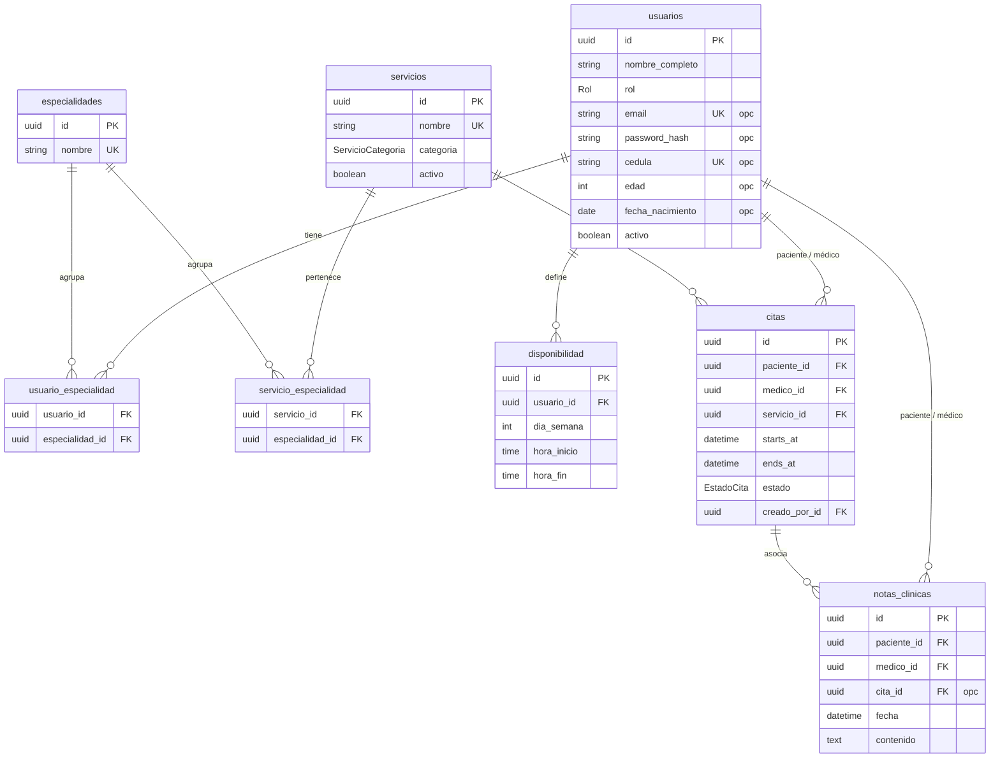

# ERP Diagnóstico — Modelo de Datos

> Modelo del **MVP** (deadline 2 semanas), definido a partir de los requisitos reales del centro. Se formaliza como **modelos SQLAlchemy** sobre **PostgreSQL**. Incluye el diagrama entidad-relación.
> IDs tipo `uuid` (no autoincrementales) para evitar colisiones al migrar entre entornos.
> Nomenclatura **snake_case** (convención de Python/SQLAlchemy y PostgreSQL).

## Decisión clave: tabla `usuarios` unificada

Para **ahorrar código y simplificar**, personal, médicos y pacientes **comparten el mismo diseño de tabla** (`usuarios`), diferenciados por el campo `rol`. No hay tablas `User`/`Doctor`/`Patient` separadas: una sola entidad "persona" con los campos que cada rol necesita (los no aplicables quedan a `NULL`).

- **Login** solo para el personal interno (`ADMIN`, `RECEPCION`, `MEDICO`): tienen `email` + `password_hash`.
- **Pacientes** (`rol = PACIENTE`) son filas **sin contraseña**; los gestiona recepción (no acceden al sistema).
- En la interfaz se mantienen **dos vistas separadas** —**Pacientes** y **Médicos**— que consultan esta misma tabla filtrando por `rol`.

## Alcance del MVP

**8 tablas** (una, `notas_clinicas`, **reservada para fase 2**). Se prioriza lo demostrable y las validaciones que pidió la profe.

| Núcleo (MVP) | Fuera del MVP (→ fase 2) |
|--------------|--------------------------|
| `usuarios`, `especialidades`, `usuario_especialidad`, `servicios`, `servicio_especialidad`, `disponibilidad`, `citas` | historia clínica / notas (`notas_clinicas`, tabla creada como andamiaje) · Reportes · recordatorios WhatsApp · auditoría · visitas (agrupar estudios) · duración por médico · recursos/salas + anti-solapamiento por recurso · holter colocación+retiro · constraint `gist` en BD · PWA offline |

## Decisiones cerradas (con datos reales del centro)

- **Usuarios:** solo personal interno hace login (`ADMIN`, `RECEPCION`, `MEDICO`). Las citas las agenda **recepción**. Los pacientes son registros, no usuarios con acceso.
- **Roles:** ADMIN todo · RECEPCION agenda/pacientes y **consulta** médicos, pero **sin** usuarios, configuración ni reportes · MEDICO su agenda (**solo lectura**; la asistencia y la cancelación las hacen recepción/admin; las notas clínicas quedan para fase 2).
- **Paciente:** al agendar se identifica por **`nombre_completo` + `edad`** (lo que pide recepción). La **cédula** la solicitan los especialistas al realizar la consulta/estudio (para el informe): es **opcional** y se añade **después** (única si se indica).
- **Alta de paciente al agendar (upsert):** al crear una cita el sistema **busca al paciente por `nombre_completo` + `edad`** (coincidencia exacta de ambos); si **existe** lo reutiliza, si **no existe** lo **crea** con `rol = PACIENTE`; si **varios coinciden** (nombres repetidos), recepción **elige** de una lista. Nunca se duplica.
- **Duración de la cita:** la **elige recepción** al agendar, de una lista fija ({15, 30, 45, 60, 90} min). `ends_at = starts_at + duracion_min`. El servicio ya no la marca.
- **Disponibilidad y sobrecupo:** cada médico define sus franjas semanales (`disponibilidad`); el calendario **bloquea** por defecto los días/horas fuera de ellas. Recepción puede **forzar un cupo extra** (sobrecupo, de mutuo acuerdo con el médico) con una confirmación. El **solapamiento exacto** (mismo médico a la misma hora) **sí se bloquea siempre**.
- **Cero solapamientos (MVP): solo por médico.** Un médico no puede tener dos citas activas que se solapen en el tiempo. *(El anti-solapamiento por recurso/sala queda para fase 2.)*
- **Historia clínica (fase 2, fuera del MVP):** notas de texto por paciente (`notas_clinicas`), que escribiría el médico. La tabla ya existe como andamiaje, pero en el MVP el rol MEDICO solo consulta su agenda.
- **Pagos y facturación:** **fuera del sistema**. **Sede:** una sola.

---

## Entidades

### `usuarios` — persona única (personal, médicos y pacientes)
| Campo | Tipo | Nota |
|-------|------|------|
| id | uuid (PK) | |
| nombre_completo | string | |
| rol | `Rol` | ADMIN · RECEPCION · MEDICO · PACIENTE |
| email | string?, único | login (solo staff) |
| password_hash | string? | bcrypt (solo staff) |
| cedula | string?, **única si se indica** | documento; **opcional**, la añaden los especialistas después |
| edad | int? | edad al registrar (lo que pide recepción) |
| fecha_nacimiento | date? | opcional; se completa luego (con la cédula/informe) |
| telefono | string? | (varios pacientes pueden compartir número) |
| matricula | string? | nº de colegiado (solo médico) |
| alergias | text? | dato clínico del paciente (opcional; uso ampliado en fase 2) |
| antecedentes | text? | dato clínico del paciente (opcional; uso ampliado en fase 2) |
| activo | bool (def. true) | baja lógica |
| created_at / updated_at | datetime | |

> Un mismo diseño de tabla sirve para los cuatro roles; la vista de **Pacientes** filtra `rol = PACIENTE` y la de **Médicos** filtra `rol = MEDICO`.

### `especialidades` — especialidad médica
| Campo | Tipo | Nota |
|-------|------|------|
| id | uuid (PK) | |
| nombre | string, único | ej. Cardiología |

### `usuario_especialidad` — N:M médico ↔ especialidad
`usuario_id` (FK → usuarios) · `especialidad_id` (FK → especialidades) · PK compuesta.

### `servicios` — catálogo de consultas y estudios
| Campo | Tipo | Nota |
|-------|------|------|
| id | uuid (PK) | |
| nombre | string, único | ej. Consulta cardiología, Ecocardiograma, Holter de ritmo, Ecografía abdominal, Doppler carotídeo… |
| categoria | `ServicioCategoria` | CONSULTA · ECOGRAFIA · DOPPLER · ESTUDIO_CARDIACO · PROMOCION · OTRO |
| activo | bool (def. true) | |

### `servicio_especialidad` — N:M servicio ↔ especialidad
`servicio_id` (FK → servicios) · `especialidad_id` (FK → especialidades) · PK compuesta.

> Permite que al elegir un médico el formulario muestre **solo** los servicios de sus especialidades (`GET /servicios?medico_id=…`).

### `disponibilidad` — franjas semanales del médico
`id` · `usuario_id` (FK → usuarios, médico) · `dia_semana` (0–6, 0=domingo) · `hora_inicio` (time) · `hora_fin` (time).

> El calendario lee esto para **grisar** (no clicable) los días/horas en que el médico no atiende; al guardar, el backend **revalida** que la cita cae dentro de la disponibilidad.

### `citas` — la cita (núcleo)
| Campo | Tipo | Nota |
|-------|------|------|
| id | uuid (PK) | |
| paciente_id | uuid (FK → usuarios) | rol PACIENTE |
| medico_id | uuid (FK → usuarios) | rol MEDICO |
| servicio_id | uuid (FK → servicios) | |
| starts_at | datetime | |
| ends_at | datetime | = starts_at + la duración elegida al agendar |
| estado | `EstadoCita` | SCHEDULED · CONFIRMED · CANCELLED · COMPLETED · NO_SHOW |
| motivo | string? | |
| creado_por_id | uuid (FK → usuarios) | recepción que la agendó |
| created_at / updated_at | datetime | |

### `notas_clinicas` — historia clínica (**reservada para fase 2, fuera del MVP**)
> La tabla existe como andamiaje; su funcionalidad no forma parte del MVP.

| Campo | Tipo | Nota |
|-------|------|------|
| id | uuid (PK) | |
| paciente_id | uuid (FK → usuarios) | |
| medico_id | uuid (FK → usuarios) | quién la escribe |
| cita_id | uuid? (FK → citas) | cita asociada (opcional) |
| fecha | datetime | |
| contenido | text | evolución, hallazgos, indicaciones |

## Enums

- `Rol`: `ADMIN`, `RECEPCION`, `MEDICO`, `PACIENTE`
- `EstadoCita`: `SCHEDULED`, `CONFIRMED`, `CANCELLED`, `COMPLETED`, `NO_SHOW`
- `ServicioCategoria`: `CONSULTA`, `ECOGRAFIA`, `DOPPLER`, `ESTUDIO_CARDIACO`, `PROMOCION`, `OTRO`

## Reglas de validación (en el backend FastAPI)

> 📖 La **referencia canónica** de las reglas de negocio y su implementación está en
> [`REGLAS-DE-NEGOCIO.md`](REGLAS-DE-NEGOCIO.md). Lo de aquí es un resumen.

Toda la validación vive en la **capa de servicio** del backend (Python), antes de guardar:

1. **Upsert de paciente** — `buscar_o_crear_paciente(db, nombre_completo, edad)`: reutiliza si existe, crea con `rol = PACIENTE` si no; si hay varias coincidencias, recepción elige. La cédula se añade después.
2. **Disponibilidad (con sobrecupo)** — la cita debe caer en la `disponibilidad` del médico; si está fuera, se avisa y recepción puede **forzar un cupo extra** (override). El solapamiento exacto por médico (regla 3) se bloquea siempre.
3. **Cero solapamientos (por médico)** — una cita nueva/modificada **no puede intersectar** con otra cita **activa** (`SCHEDULED`/`CONFIRMED`) del **mismo médico**. Intersección = `nueva.starts_at < existente.ends_at` **y** `nueva.ends_at > existente.starts_at`.
4. **Cancelar libera** — al pasar a `CANCELLED` la cita sale de los estados activos y su hueco se reutiliza.

```python
# Anti-solapamiento por médico (pseudocódigo del servicio de citas)
def hay_solapamiento(db, medico_id, starts_at, ends_at):
    q = (
        db.query(Cita)
        .filter(Cita.medico_id == medico_id)
        .filter(Cita.estado.in_(["SCHEDULED", "CONFIRMED"]))
        .filter(Cita.starts_at < ends_at)   # se cruzan en el tiempo
        .filter(Cita.ends_at > starts_at)
    )
    return db.query(q.exists()).scalar()
```

## Diagrama entidad-relación



### Relaciones (resumen)

| Relación | Cardinalidad | Nota |
|----------|--------------|------|
| `usuarios` (médico) – `especialidades` | N : M | Vía `usuario_especialidad`. |
| `servicios` – `especialidades` | N : M | Vía `servicio_especialidad`. Filtra los servicios por médico al agendar. |
| `usuarios` (médico) – `disponibilidad` | 1 : N | Franjas horarias semanales. |
| `usuarios` (paciente) – `citas` | 1 : N | Citas del paciente. |
| `usuarios` (médico) – `citas` | 1 : N | Citas que atiende (anti-solapamiento por médico). |
| `servicios` – `citas` | 1 : N | Servicio de la cita. |
| `usuarios` – `notas_clinicas` | 1 : N | Historia clínica (paciente y médico). **Reservada para fase 2, fuera del MVP.** |

> **Fase 2** (si sobra tiempo): historia clínica / notas del médico (`notas_clinicas`, ya creada como andamiaje), recursos/salas + anti-solapamiento por recurso, duración por médico (`medico_servicio`), visitas para agrupar estudios, recordatorios WhatsApp, auditoría, reportes y PWA. El diseño actual permite añadirlas sin romper lo existente.
