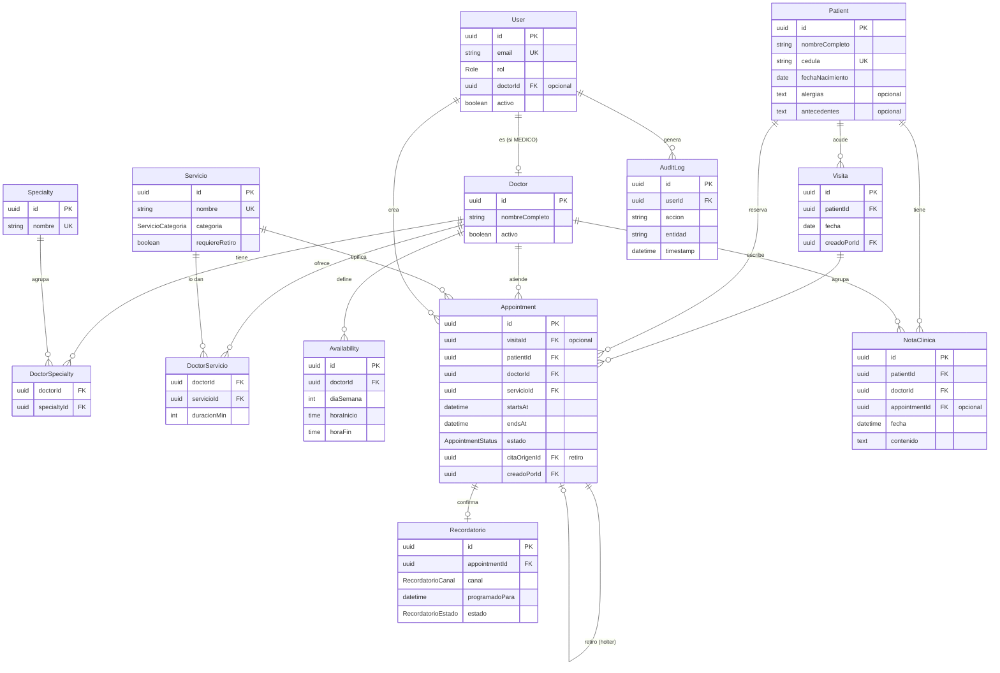

# ERP Diagnóstico — Modelo de Datos

> Modelo definido a partir de los requisitos reales del centro. Listo para formalizar en `schema.prisma`. Incluye el diagrama entidad-relación.
> IDs tipo `uuid`/`cuid` (no autoincrementales) para evitar colisiones al sincronizar o migrar entre entornos.

## Decisiones cerradas (con datos reales del centro)

- **Usuarios:** solo personal interno (`ADMIN`, `RECEPCION`, `MEDICO`). Las citas las agenda **recepción** (WhatsApp, llamada o presencial).
- **Volumen:** ~60 citas/día · 18 médicos · ~11-13 especialidades · servicios de consulta, ecografía (integral, doppler) y estudios cardíacos.
- **Especialidades:** varias por médico → relación **N:M**.
- **Paciente:** identificado preferentemente por **cédula (única si se indica, pero opcional)**; algunos pacientes (niños, extranjeros) se registran **sin cédula** y se identifican por id interno + nombre + fecha de nacimiento (hoy solo los tienen en los contactos del teléfono; nombres repetidos → la cédula/ficha los diferencia).
- **Duración de la cita:** depende del **médico + servicio** (ej. Dra Fabiola: consulta 45', ecocardiograma 30'; Richard: consulta 60', ecocardiograma 30'). → entidad `DoctorServicio` con la duración.
- **Visita:** un paciente suele tener **2-3 estudios el mismo día** (eco + ecocardiograma + holter). Se agrupan en una **`Visita`**.
- **Historia clínica:** se incluye (notas por visita, útiles para reconsultas o si le atiende otro especialista del área).
- **Recordatorios:** función principal — confirmación de asistencia por **WhatsApp** el día antes (hoy lo hacen a mano y quita mucho tiempo).
- **Facturación:** **fuera del sistema** (el SENIAT obliga a máquinas fiscales aparte).
- **Estudios multi-día (holter/MAPA):** se colocan un día y se retiran al siguiente → **cita de colocación + cita de retiro** enlazadas.

## Entidades

### `User` — personal con acceso
| Campo | Tipo | Nota |
|-------|------|------|
| id | uuid (PK) | |
| email | string, único | login |
| passwordHash | string | argon2/bcrypt |
| nombre | string | |
| rol | `Role` | ADMIN · RECEPCION · MEDICO |
| doctorId | uuid?, único | si es médico → 1:1 con `Doctor` |
| activo | bool (def. true) | baja lógica |
| createdAt / updatedAt | datetime | |

### `Doctor` — profesional
| Campo | Tipo | Nota |
|-------|------|------|
| id | uuid (PK) | |
| nombreCompleto | string | |
| matricula | string? | nº de registro/colegiado |
| activo | bool (def. true) | |
| especialidades | N:M vía `DoctorSpecialty` | |
| servicios | N:M vía `DoctorServicio` (con duración) | |
| disponibilidad | 1:N `Availability` | |

### `Specialty` — especialidad médica
| Campo | Tipo | Nota |
|-------|------|------|
| id | uuid (PK) | |
| nombre | string, único | ej. Cardiología |

### `DoctorSpecialty` — N:M médico ↔ especialidad
`doctorId` (FK) · `specialtyId` (FK) · PK compuesta.

### `Servicio` — catálogo de consultas y estudios
| Campo | Tipo | Nota |
|-------|------|------|
| id | uuid (PK) | |
| nombre | string, único | ej. Consulta cardiología, Ecocardiograma, Holter, MAPA, Eco abdominal, Doppler… |
| categoria | `ServicioCategoria` | CONSULTA · ECOGRAFIA · ESTUDIO_CARDIACO · OTRO |
| requiereRetiro | bool (def. false) | true en holter/MAPA (colocación + retiro) |
| activo | bool (def. true) | |

### `DoctorServicio` — qué hace cada médico y **cuánto dura**
| Campo | Tipo | Nota |
|-------|------|------|
| doctorId | uuid (FK) | |
| servicioId | uuid (FK) | |
| duracionMin | int | **duración específica de ese médico para ese servicio** |
| — | PK compuesta (doctorId, servicioId) | |

> De aquí sale la duración de la cita: (médico + servicio) → `duracionMin`.

### `Patient` — paciente (gestionado por recepción)
| Campo | Tipo | Nota |
|-------|------|------|
| id | uuid (PK) | |
| nombreCompleto | string | |
| cedula | string?, **único si se indica** | documento (Venezuela); **opcional** (niños/extranjeros sin cédula) |
| fechaNacimiento | date | |
| telefono | string? | (varios pacientes pueden compartir número) |
| email | string? | |
| alergias | text? | para la historia clínica |
| antecedentes | text? | para la historia clínica |
| createdAt / updatedAt | datetime | |

### `Availability` — disponibilidad recurrente del médico
`id` · `doctorId` (FK) · `diaSemana` (0–6, 0=domingo) · `horaInicio` (time) · `horaFin` (time).

### `Visita` — agrupa las citas de un paciente en un día
| Campo | Tipo | Nota |
|-------|------|------|
| id | uuid (PK) | |
| patientId | uuid (FK) | |
| fecha | date | |
| creadoPorId | uuid (FK → User) | recepción que la agendó |
| notas | text? | |
| createdAt | datetime | |

> Una visita agrupa varias `Appointment` (ej. eco 9:00 + ecocardiograma 9:30 + holter 10:00).

### `Appointment` — la cita (núcleo)
| Campo | Tipo | Nota |
|-------|------|------|
| id | uuid (PK) | |
| visitaId | uuid? (FK) | opcional; agrupa citas del mismo día/paciente |
| patientId | uuid (FK) | → `Patient` |
| doctorId | uuid (FK) | → `Doctor` |
| servicioId | uuid (FK) | → `Servicio` |
| startsAt | datetime | |
| endsAt | datetime | = startsAt + `DoctorServicio.duracionMin` |
| estado | `AppointmentStatus` | SCHEDULED · CONFIRMED · CANCELLED · COMPLETED · NO_SHOW |
| motivo | string? | |
| citaOrigenId | uuid? (FK → Appointment) | enlaza el **retiro** con la **colocación** (holter/MAPA) |
| creadoPorId | uuid (FK → User) | |
| createdAt / updatedAt | datetime | |

### `NotaClinica` — historia clínica (notas de evolución)
| Campo | Tipo | Nota |
|-------|------|------|
| id | uuid (PK) | |
| patientId | uuid (FK) | |
| doctorId | uuid (FK) | quién la escribe |
| appointmentId | uuid? (FK) | visita/cita asociada |
| fecha | datetime | |
| contenido | text | evolución, hallazgos, indicaciones |

> El médico consulta el historial del paciente en reconsultas o si le atiende otro especialista del área.

### `Recordatorio` — confirmación de asistencia
| Campo | Tipo | Nota |
|-------|------|------|
| id | uuid (PK) | |
| appointmentId | uuid (FK) | (o `visitaId` si se confirma la visita completa) |
| canal | `RecordatorioCanal` | WHATSAPP (posible LLAMADA manual) |
| programadoPara | datetime | normalmente el día antes |
| estado | `RecordatorioEstado` | PENDIENTE · ENVIADO · CONFIRMADO · FALLIDO |
| enviadoAt | datetime? | |

### `AuditLog` — trazabilidad (HIPAA/GDPR)
`id` · `userId?` (FK) · `accion` (CREATE/UPDATE/DELETE/LOGIN/VIEW) · `entidad` · `entidadId?` · `detalle` (json?) · `timestamp`.

## Enums

- `Role`: `ADMIN`, `RECEPCION`, `MEDICO`
- `AppointmentStatus`: `SCHEDULED`, `CONFIRMED`, `CANCELLED`, `COMPLETED`, `NO_SHOW`
- `ServicioCategoria`: `CONSULTA`, `ECOGRAFIA`, `ESTUDIO_CARDIACO`, `OTRO`
- `RecordatorioCanal`: `WHATSAPP`, `LLAMADA`
- `RecordatorioEstado`: `PENDIENTE`, `ENVIADO`, `CONFIRMADO`, `FALLIDO`

## Regla crítica: cero solapamientos

Una cita nueva o modificada **no puede intersectar en el tiempo** con otra cita **activa** (`SCHEDULED`/`CONFIRMED`) del **mismo médico**. Intersección = `nueva.startsAt < existente.endsAt` **y** `nueva.endsAt > existente.startsAt`.

- El bloqueo es **por médico** (recurso). Un **paciente sí** puede tener varias citas encadenadas el mismo día con distintos médicos/estudios (eso es una `Visita`); si dos citas del paciente coinciden en hora, se muestra un **aviso no bloqueante** (salvo casos como el holter, que se lleva puesto).
- **Pendiente por confirmar:** si algunos estudios usan **equipos/salas compartidos** entre médicos. Si aplica, se añadiría un recurso (`Sala`/`Equipo`) y se extendería el anti-solapamiento también a ese recurso.

Doble defensa:
1. **Capa de servicio** — validación antes de guardar (mensaje claro).
2. **Base de datos** — constraint de exclusión temporal por médico:

```sql
-- Requiere la extensión btree_gist
ALTER TABLE "Appointment"
  ADD CONSTRAINT no_overlap
  EXCLUDE USING gist (
    "doctorId" WITH =,
    tstzrange("startsAt", "endsAt") WITH &&
  )
  WHERE (estado IN ('SCHEDULED', 'CONFIRMED'));
```

## Diagrama entidad-relación



### Relaciones (resumen)

| Relación | Cardinalidad | Nota |
|----------|--------------|------|
| `User` – `Doctor` | 1 : 0..1 | Un usuario `MEDICO` enlaza con su ficha. |
| `Doctor` – `Specialty` | N : M | Vía `DoctorSpecialty`. |
| `Doctor` – `Servicio` | N : M | Vía `DoctorServicio` (**con duración por médico**). |
| `Doctor` – `Availability` | 1 : N | Franjas horarias. |
| `Patient` – `Visita` | 1 : N | Visitas del paciente. |
| `Visita` – `Appointment` | 1 : N | Estudios/consultas de esa visita. |
| `Appointment` – `Appointment` | 1 : 0..1 | Retiro enlazado (holter/MAPA). |
| `Appointment` – `Recordatorio` | 1 : 0..1 | Confirmación de asistencia. |
| `Patient` / `Doctor` – `NotaClinica` | 1 : N | Historia clínica. |
