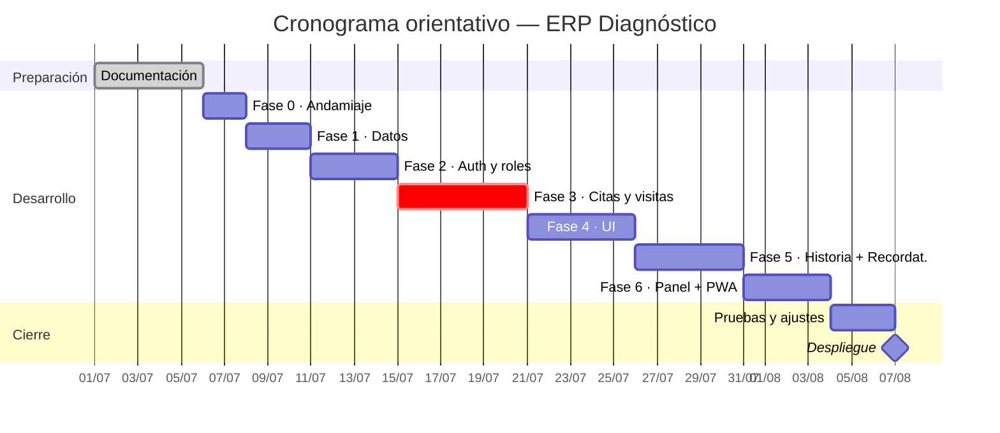

# ERP Diagnóstico — Roadmap y Planificación

Plan de proyecto, decisiones, fases, cronograma y riesgos. Basado en `CLAUDE.md` + decisiones acordadas.

## 0. Decisiones acordadas (con datos reales del centro)

- **Usuarios:** solo **personal interno**. Las citas las agenda **recepción** (WhatsApp, llamada, presencial). Sin portal de pacientes.
- **Volumen:** ~60 citas/día · 18 médicos · ~11-13 especialidades.
- **Arquitectura:** **en la nube** (Vercel + Neon). Necesitan **acceso remoto** (consultar la agenda desde el móvil varias veces al día).
- **Internet:** ya es estable (tienen **planta eléctrica**). Crear citas online es viable; la PWA da consulta offline de la agenda como respaldo.
- **Duración de cita:** por **médico + servicio** (no global).
- **Visita:** agrupar los **varios estudios** del paciente el mismo día.
- **Historia clínica:** **en el MVP** (notas por visita, para reconsultas).
- **Recordatorios WhatsApp:** **función principal** (automatizar la confirmación del día antes, hoy manual).
- **Facturación:** **fuera** (máquinas fiscales del SENIAT, aparte).
- **Google Calendar:** por ahora no (la vista móvil cubre la consulta desde el teléfono).
- **Idioma UI:** español. · **Gestor de paquetes:** pnpm.

## 1. Objetivo

Software interno para el centro de salud **Diagnóstico**, centrado en la **gestión y creación de citas médicas**, con validación estricta de horarios (cero solapamientos) y protección de datos médicos (HIPAA/GDPR).

## 2. Stack

| Capa | Tecnología | Dónde |
|------|-----------|-------|
| Runtime | Node 22+ | — |
| Lenguaje | TypeScript | — |
| Framework | Next.js (App Router) | **Vercel** |
| Base de datos | PostgreSQL + Prisma | **Neon** (serverless) |
| Estilos | Tailwind CSS | — |
| Auth | Auth.js (credenciales) o propia | — |
| Gestor de paquetes | pnpm | — |
| Entorno | variables en `.env` / Vercel (sin credenciales hardcodeadas) | — |

Todo con **capa gratuita** → coste cero para el bootcamp.

### Resiliencia ante internet inestable

- **PWA**: cachea la última agenda cargada → el personal **sigue viendo** las citas del día aunque parpadee el internet. Crear/editar requiere conexión.
- **Trade-off asumido**: durante un corte no se pueden *crear* citas; a cambio se gana acceso remoto, respaldos automáticos y cero instalación en el centro.

## 3. Alcance del MVP

1. **Autenticación y roles** — login + `ADMIN`, `RECEPCION`, `MEDICO`.
2. **Pacientes** — CRUD (cédula única si se indica, opcional).
3. **Médicos, especialidades y servicios** — con **duración por médico + servicio** y disponibilidad.
4. **Citas y visitas** — agendar varios estudios el mismo día, con **anti-solapamiento por médico**; holter/MAPA (colocación + retiro).
5. **Historia clínica** — notas por visita.
6. **Recordatorios por WhatsApp** — confirmación **automática** el día antes.
7. **Panel** — agenda del día, calendario y métricas; consultable desde el móvil (PWA).
8. **Auditoría**.

> **Fuera del MVP:** facturación (SENIAT, aparte), portal de pacientes, Google Calendar, adjuntos pesados en la historia.

## 4. Modelo de datos

**Definido** → ver [`MODELO-DATOS.md`](MODELO-DATOS.md) (incluye el diagrama entidad-relación).

Resumen: `User`, `Doctor`, `Specialty` (N:M), `Servicio` + `DoctorServicio` (**duración por médico**), `Patient`, `Availability`, `Visita`, `Appointment` (cero solapamientos), `NotaClinica` (historia), `Recordatorio`, `AuditLog`.

> **Estructura de carpetas** y detalle técnico → ver [`ARQUITECTURA.md`](ARQUITECTURA.md).

## 5. Fases, hitos y cronograma

| Fase | Objetivo | Hito / entregable | Duración |
|------|----------|-------------------|:--------:|
| **Documentación** | Requisitos, modelo, diagramas | ✅ Docs completas en `docs/` | — |
| **Fase 0 — Andamiaje** | Next.js + TS + Tailwind + Prisma; Neon; deploy Vercel | App corriendo ("hola mundo" online) | 2 d |
| **Fase 1 — Datos** | Esquema Prisma (servicios, duración por médico, visita, historia, recordatorios) + migración + seed | BD conectada con datos base | 3 d |
| **Fase 2 — Auth y roles** | Login, sesión, guards por rol | Acceso por rol funcionando | 4 d |
| **Fase 3 — Citas y visitas (core)** | Servicio de citas/visitas + anti-solapamiento por médico + holter/retiro + tests | Reglas de negocio validadas | 6 d |
| **Fase 4 — UI** | Calendario, formularios, pacientes/médicos, visita multi-estudio | Flujo de citas usable | 5 d |
| **Fase 5 — Historia clínica + Recordatorios** | Notas por visita + confirmación automática por WhatsApp (API Meta + cron) | Historia y recordatorios funcionando | 5 d |
| **Fase 6 — Panel + PWA** | Métricas, auditoría, vista móvil offline | MVP completo | 4 d |
| **Despliegue** | Vercel + Neon | App publicada | — |

### Cronograma (Gantt)

> ⚠️ Fechas **orientativas**: ajústalas a tu calendario real del bootcamp.

## 6. Tablero de tareas (Kanban orientativo)

**Por hacer**
- Andamiaje del proyecto (Fase 0)
- Esquema Prisma —servicios, duración por médico, visita, historia, recordatorios— y migración (Fase 1)
- Login y roles (Fase 2)
- Citas y visitas + anti-solapamiento + holter/retiro + tests (Fase 3)
- Calendario, formularios y visita multi-estudio (Fase 4)
- Historia clínica + recordatorios WhatsApp automáticos (Fase 5)
- Panel, auditoría y PWA (Fase 6)
- Despliegue en Vercel + Neon

**En curso**
- (vacío)

**Hecho**
- Planificación y decisiones de arquitectura
- Modelo de datos y diagrama ER
- Documentación funcional, casos de uso, flujo de usuario y manual
- Prototipo visual (mockup)

## 7. Riesgos y mitigación

| Riesgo | Mitigación |
|--------|-----------|
| Internet inestable (Venezuela) | Arquitectura nube + PWA de lectura offline |
| Solapamiento de citas por concurrencia | Constraint de exclusión temporal en BD |
| Fuga de datos médicos | Hash de contraseñas, RBAC, auditoría, secretos en `.env` |
| Alcance amplio | MVP claro; extras (WhatsApp, historia clínica) fuera del MVP |

## 8. Decisiones pendientes

1. **Auth**: recomendado **Auth.js en modo credenciales** (usuario/contraseña). ¿OK o implementación propia?
2. ¿Hay **enunciado formal** del bootcamp con criterios de evaluación? Si sí, se alinea.
3. **Fecha de entrega**, para priorizar el MVP y ajustar el cronograma.
