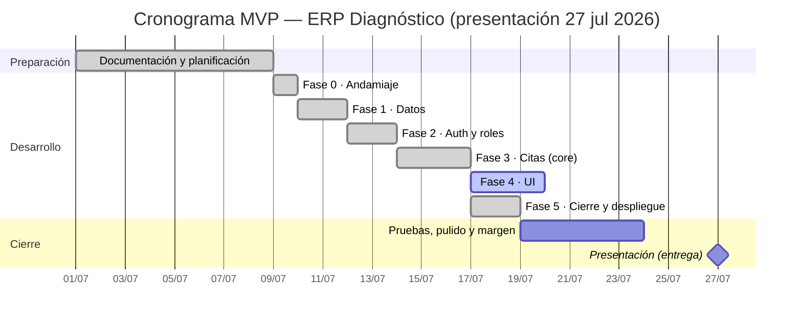

# ERP Diagnóstico — Roadmap y Planificación

Plan de proyecto, decisiones, fases, cronograma y riesgos del **MVP** (entrega/presentación: **27 jul 2026**). Basado en las guías y decisiones acordadas del proyecto.

## 0. Decisiones acordadas (con datos reales del centro)

- **Usuarios:** solo **personal interno** hace login (ADMIN, RECEPCION, MEDICO). Las citas las agenda **recepción**. Los pacientes son registros, no acceden.
- **Tabla `usuarios` unificada:** personal, médicos y pacientes comparten el mismo diseño de tabla (campo `rol`), para **ahorrar código**. En la UI, **dos vistas** (Pacientes / Médicos) que filtran por rol.
- **Roles:** ADMIN todo · **RECEPCION sin acceso a usuarios, configuración ni reportes** · MEDICO su agenda **solo lectura** (solo consulta; la asistencia y la cancelación las hacen recepción/admin; notas clínicas → fase 2).
- **Volumen:** ~60 citas/día · 18 médicos · 12 especialidades.
- **Duración de cita:** la **elige recepción** al agendar, de una lista fija ({15, 30, 45, 60, 90} min).
- **Disponibilidad:** el calendario **bloquea** los días/horas fuera de la disponibilidad del médico.
- **Upsert de paciente al agendar:** si el paciente no existe se crea, si existe se detecta (por `nombre_completo + edad`).
- **Cero solapamientos:** en el MVP, **solo por médico** (por recurso → fase 2).
- **Historia clínica:** **fuera del MVP → fase 2** (notas de texto del médico). En el MVP el médico **solo consulta** su agenda (sin marcar asistencia ni escribir notas clínicas).
- **Facturación y cobros:** **fuera** del sistema. **Sede:** una sola.
- **Idioma UI:** español. · **Gestor de paquetes (frontend):** pnpm.

## 1. Objetivo

Software interno para el centro de salud **Diagnóstico**, centrado en la **gestión y creación de citas médicas**, con login por roles, validación estricta de horarios (cero solapamientos por médico) y bloqueo por disponibilidad.

## 2. Stack

| Capa | Tecnología |
|------|-----------|
| Backend | **Python + FastAPI** |
| ORM | **SQLAlchemy** (migraciones con **Alembic**) |
| Base de datos | **PostgreSQL** (Render gestionado en prod · Neon o local en dev) |
| Auth | **JWT** (contraseñas con bcrypt) |
| Frontend | **React (Vite, JavaScript)** + React Router |
| Estilos | Tailwind CSS |
| Gestor de paquetes | **pnpm** (frontend) · pip (backend) |
| Entorno | variables en `.env` (sin credenciales hardcodeadas) |

> Sin Prisma, sin Next.js, sin TypeScript (no vistos en el bootcamp).

## 3. Alcance del MVP

1. **Autenticación y roles** — login JWT + `ADMIN`, `RECEPCION`, `MEDICO` (guardas por rol).
2. **Usuarios** — CRUD del personal y médicos (ADMIN). Médicos con **especialidades (N:M)** y **disponibilidad**.
3. **Pacientes** — CRUD (cédula única si se indica, opcional) + **upsert al agendar**.
4. **Servicios** — catálogo de consultas y estudios (la duración de la cita la elige recepción al agendar).
5. **Citas y calendario** — agendar con **anti-solapamiento por médico** y **bloqueo por disponibilidad**; estados y cancelación (libera cupo).
6. **Agenda del médico (solo lectura)** — el médico consulta su propia agenda; **no** marca asistencia ni cancela (lo hace recepción/admin) ni escribe notas clínicas en el MVP.

> **Fuera del MVP (→ fase 2):** identificación robusta del paciente (por `fecha_nacimiento` obligatoria y/o `cédula`) — en el MVP se identifica por `nombre_completo + edad`, con la limitación conocida de posibles duplicados —, historia clínica / notas clínicas del médico, reportes, recordatorios WhatsApp, auditoría, visitas (agrupar estudios), duración por médico (`medico_servicio`), recursos/salas + anti-solapamiento por recurso, holter colocación+retiro, constraint `gist` en BD, PWA offline, portal de pacientes, Google Calendar, facturación (SENIAT).

## 3.1 Contrato de la API — checklist de endpoints (derivado del MANUAL/RF)

> **Fuente de verdad ejecutable.** Cada acción que prometen el MANUAL y los requisitos (RF) tiene aquí su endpoint y su estado. **Antes de dar una fase por "hecha", se coteja contra esta tabla** (esta checklist es la red de seguridad que faltaba). `✅` implementado · `⬜` pendiente.

**Auth**

| Endpoint | Acción | Rol | Origen | Estado |
|----------|--------|-----|--------|:------:|
| `POST /auth/login` | Iniciar sesión (JWT) | público | RF-01 · MANUAL §1 | ✅ |
| `GET /auth/me` | Usuario y rol de la sesión | autenticado | MANUAL §2 | ✅ |

**Usuarios (personal y médicos) — ADMIN**

| Endpoint | Acción | Rol | Origen | Estado |
|----------|--------|-----|--------|:------:|
| `GET /usuarios` · `GET /usuarios/{id}` | Listar / ficha de personal | ADMIN | MANUAL §6,§7 | ✅ |
| `POST /usuarios` | Alta de personal/médico (+ especialidades) | ADMIN | RF-02/04 · MANUAL §6,§7 | ✅ |
| `PUT /usuarios/{id}` | Editar usuario | ADMIN | RF-02 | ✅ |
| `DELETE /usuarios/{id}` | Baja lógica (`activo=False`) | ADMIN | MANUAL §7 | ✅ |

**Catálogos (lectura) — autenticado**

| Endpoint | Acción | Rol | Origen | Estado |
|----------|--------|-----|--------|:------:|
| `GET /servicios` · `GET /medicos` · `GET /especialidades` | Alimentar desplegables al agendar | autenticado | MANUAL §3 | ✅ |

**Disponibilidad — lectura autenticada / gestión ADMIN**

| Endpoint | Acción | Rol | Origen | Estado |
|----------|--------|-----|--------|:------:|
| `GET /disponibilidad` | Ver las franjas de un médico | autenticado | MANUAL §6.3 | ✅ |
| `POST /disponibilidad` | Definir una franja del médico | ADMIN | MANUAL §6.3 | ✅ |

**Pacientes — ADMIN/RECEPCION**

| Endpoint | Acción | Rol | Origen | Estado |
|----------|--------|-----|--------|:------:|
| `GET /pacientes` · `GET /pacientes/{id}` | Listar / ficha | ADMIN·RECEP | MANUAL §5 | ✅ |
| `PUT /pacientes/{id}` | Editar ficha (parcial) | ADMIN·RECEP | MANUAL §5 | ✅ |
| `POST /pacientes` | **Alta de paciente suelto** | ADMIN·RECEP | RF-05 · MANUAL §5.2 | ✅ |
| `GET /pacientes/{id}/citas` | **Historial de citas del paciente** | ADMIN·RECEP | MANUAL §5.3 | ✅ |

**Citas**

| Endpoint | Acción | Rol | Origen | Estado |
|----------|--------|-----|--------|:------:|
| `POST /citas` | Agendar (aplica todas las reglas) | ADMIN·RECEP | RF-07 · MANUAL §3 | ✅ |
| `GET /citas` | Agenda por día / rango | ADMIN·RECEP·MED | MANUAL §4,§8 | ✅ |
| `POST /citas/{id}/cancelar` | Cancelar (libera cupo) | ADMIN·RECEP | RF-11 · MANUAL §4 | ✅ |
| `POST /citas/{id}/asistencia` | Atendida / no-show | ADMIN·RECEP | MANUAL §4 | ✅ |
| `PUT /citas/{id}` | **Editar / mover (revalida reglas)** | ADMIN·RECEP | RF-07 · MANUAL §4 | ✅ |

**Servicios y especialidades (gestión) — ADMIN**

| Endpoint | Acción | Rol | Origen | Estado |
|----------|--------|-----|--------|:------:|
| `POST /servicios` · `PUT /servicios/{id}` | Crear / editar servicio | ADMIN | RF-02 · MANUAL §6.4 | ✅ |
| `POST /especialidades` | Crear especialidad | ADMIN | MANUAL §6 | ✅ |

### Pendientes → plan de cierre del backend

- **Contrato de la API: ✅ 100% cerrado.** Todos los endpoints del MANUAL/RF están implementados y probados. El backend queda listo para el frontend (Fase 4).
- `POST /pacientes`, `GET /pacientes/{id}/citas` y `PUT /citas/{id}` (editar/mover) cierran las vistas de **Pacientes** y **Citas**.
- La gestión de `servicios`/`especialidades` (ADMIN) queda cubierta; los catálogos siguen precargándose por el seed y ahora además se pueden mantener por API.

### Deuda técnica detectada (revisión) → fase 2

> De una revisión de código del backend. No bloquean el MVP; se anotan para no perderlas.

- **Convención de fechas:** la API trabaja en **hora local naive**: el frontend envía la hora local del centro **sin zona**; si llega con zona (p. ej. la `Z` de `toISOString()`), **se rechaza con 422** (contrato explícito, sin conversiones a ciegas). La regla "no en el pasado" calcula el "ahora" en **hora local del centro (UTC-4)** en el backend, para no descuadrar aunque el servidor corra en UTC (Render).
- **Router de citas:** el mapeo excepción→HTTP se repite entre agendar y editar (se dejó **explícito a propósito** por legibilidad).
- **Disponibilidad:** `crear_disponibilidad` no valida franjas duplicadas/solapadas por médico y día.
- **Login enumerable por *timing*:** responde sin llamar a bcrypt cuando el email no existe (oráculo de emails; riesgo bajo en tool interno).
- **Sin paginación** en los listados de pacientes/personal.
- **Unicidad sensible a mayúsculas/acentos** en `nombre`/`email`/`cédula`.
- **CORS de un solo origen:** al desplegar, permitir local + producción a la vez.

## 4. Modelo de datos

**Definido** → ver [`MODELO-DATOS.md`](MODELO-DATOS.md) (incluye el diagrama entidad-relación).

Resumen (7 tablas): `usuarios` (unificada), `especialidades` + `usuario_especialidad` (N:M), `servicios`, `disponibilidad`, `citas` (cero solapamientos por médico), `notas_clinicas` (**reservada para fase 2, fuera del MVP**).

> **Estructura de carpetas** y detalle técnico → ver [`ARQUITECTURA.md`](ARQUITECTURA.md).

## 5. Fases y cronograma (2 semanas)

| Fase | Objetivo | Hito / entregable | Duración |
|------|----------|-------------------|:--------:|
| **Documentación** | Requisitos, modelo, diagramas (actualizados al nuevo stack) | ✅ Docs en `docs/` | — |
| **Fase 0 — Andamiaje** | Backend FastAPI (este repo) + frontend React/Vite (**repo aparte**) corriendo; conexión a PostgreSQL | "Hola mundo" front↔back | 1 d |
| **Fase 1 — Datos** | Modelos SQLAlchemy + migración Alembic + seed (usuarios, especialidades, servicios) | BD conectada con datos base | 2 d |
| **Fase 2 — Auth y roles** | Login JWT, hash de contraseñas, dependencia `requiere_rol` | Acceso por rol funcionando | 2 d |
| **Fase 3 — Citas (core)** | Servicio de citas: upsert de paciente + disponibilidad + anti-solapamiento por médico + tests | Reglas de negocio validadas | 3 d |
| **Fase 4 — UI** | Login, calendario/agenda, vistas Pacientes y Médicos, formulario de cita | Flujo de citas usable | 3 d |
| **Fase 5 — Cierre y despliegue** | Pulido, pruebas manuales, despliegue | MVP demostrable | 2 d |

### Cronograma (Gantt)

> Rebaselinado el **9 jul 2026**. Entrega/presentación: **27 jul 2026** → hay **margen holgado** (~5 días de buffer tras el desarrollo).

## 6. Tablero de tareas (Kanban orientativo)

**Por hacer**
- Calendario, vistas Pacientes/Médicos y formulario de cita (Fase 4, frontend en repo aparte)

**En curso**
- **Fase 4 — UI:** login, calendario/agenda y formulario de cita en el frontend (repo aparte).

**Hecho (reciente)**
- **Contrato de la API completo** (ver §3.1): `POST /pacientes`, `GET /pacientes/{id}/citas`, `PUT /citas/{id}` (editar/mover) y gestión de `servicios`/`especialidades` (ADMIN).

**Hecho**
- Planificación y decisiones de arquitectura
- Modelo de datos y diagrama ER (unificado)
- Documentación funcional, casos de uso, flujo de usuario y manual
- Prototipo visual (mockup)
- Documentación actualizada al stack React + Python
- **Fase 0** — Andamiaje backend FastAPI + conexión a PostgreSQL (frontend React/Vite en repo aparte)
- **Fase 1** — Modelos SQLAlchemy (7 tablas) + Alembic + migración inicial + seed de catálogos (12 especialidades, 19 servicios)
- **Fase 2** — Auth JWT (bcrypt), dependencia `requiere_rol` y guardas por rol (ADMIN/RECEPCION/MEDICO)
- **Fase 3 — Citas (núcleo)** — Servicio `crear_cita`: upsert de paciente + disponibilidad + anti-solapamiento por médico + **rejilla de inicio (:00/:15/:30/:45)**; endpoints de citas (crear, listar por fecha/rango, cancelar, marcar asistencia), catálogos de lectura (`servicios`, `medicos`, `especialidades`), disponibilidad, pacientes (listar/ficha/editar) y CRUD de usuarios/médicos; **97 tests en verde** (tras completar el contrato y la revisión de código).
- **Fase 5 — Despliegue** — Backend en producción en **Render** (release **v0.4.0**, auto-deploy en push a `main`, ejecuta `alembic upgrade head` y el seed)

## 7. Riesgos y mitigación

| Riesgo | Mitigación |
|--------|-----------|
| **Plazo (presentación 27 jul)** | MVP recortado (7 tablas), extras a fase 2, foco en el core; queda buffer de pruebas antes de presentar |
| Solapamiento de citas | Validación en la capa de servicio (backend) antes de guardar |
| Fuga de datos médicos | Hash de contraseñas (bcrypt), JWT, RBAC por rol, secretos en `.env` |
| Alcance amplio | Lista explícita de "fuera del MVP" para no dispersarse |

## 8. Decisiones cerradas / pendientes

1. **Auth:** JWT propio con FastAPI (bcrypt + PyJWT). ✔️
2. **BD:** PostgreSQL. En **producción** se usa el Postgres gestionado de **Render** (`diagnostico-db`, ver `render.yaml`); Neon fue la opción inicial y sigue valiendo para dev (o Postgres local). ✔️
3. **Fecha de entrega:** ~2 semanas → prioriza el MVP; ajustar el Gantt al calendario real.
