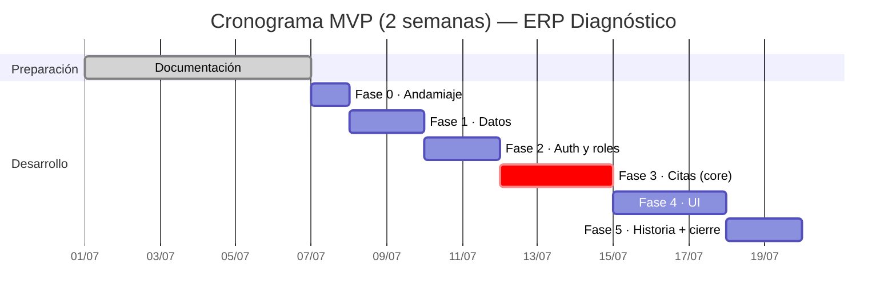

# ERP Diagnóstico — Roadmap y Planificación

Plan de proyecto, decisiones, fases, cronograma y riesgos del **MVP** (deadline: 2 semanas). Basado en `CLAUDE.md` + decisiones acordadas.

## 0. Decisiones acordadas (con datos reales del centro)

- **Usuarios:** solo **personal interno** hace login (ADMIN, RECEPCION, MEDICO). Las citas las agenda **recepción**. Los pacientes son registros, no acceden.
- **Tabla `usuarios` unificada:** personal, médicos y pacientes comparten el mismo diseño de tabla (campo `rol`), para **ahorrar código**. En la UI, **dos vistas** (Pacientes / Médicos) que filtran por rol.
- **Roles:** ADMIN todo · **RECEPCION sin acceso a usuarios, configuración ni reportes** · MEDICO su agenda + notas clínicas.
- **Volumen:** ~60 citas/día · 18 médicos · ~11-13 especialidades.
- **Duración de cita:** la marca el **servicio** (`servicios.duracion_min`).
- **Disponibilidad:** el calendario **bloquea** los días/horas fuera de la disponibilidad del médico.
- **Upsert de paciente al agendar:** si el paciente no existe se crea, si existe se detecta (por cédula o nombre + fecha de nacimiento).
- **Cero solapamientos:** en el MVP, **solo por médico** (por recurso → fase 2).
- **Historia clínica:** versión **mínima** (notas de texto del médico).
- **Facturación y cobros:** **fuera** del sistema. **Sede:** una sola.
- **Idioma UI:** español. · **Gestor de paquetes (frontend):** pnpm.

## 1. Objetivo

Software interno para el centro de salud **Diagnóstico**, centrado en la **gestión y creación de citas médicas**, con login por roles, validación estricta de horarios (cero solapamientos por médico) y bloqueo por disponibilidad.

## 2. Stack

| Capa | Tecnología |
|------|-----------|
| Backend | **Python + FastAPI** |
| ORM | **SQLAlchemy** (migraciones con **Alembic**) |
| Base de datos | **PostgreSQL** (Neon en la nube o local en dev) |
| Auth | **JWT** (contraseñas con bcrypt) |
| Frontend | **React (Vite, JavaScript)** + React Router |
| Estilos | Tailwind CSS |
| Gestor de paquetes | **pnpm** (frontend) · pip (backend) |
| Entorno | variables en `.env` (sin credenciales hardcodeadas) |

> Sin Prisma, sin Next.js, sin TypeScript (no vistos en el bootcamp).

## 3. Alcance del MVP

1. **Autenticación y roles** — login JWT + `ADMIN`, `RECEPCION`, `MEDICO` (guardas por rol).
2. **Usuarios** — CRUD del personal y médicos (ADMIN). Médicos con **especialidades (N:M)** y **disponibilidad**.
3. **Pacientes** — CRUD (cédula única si se indica, opcional) + **upsert al agendar**.
4. **Servicios** — catálogo con **duración** (`duracion_min`).
5. **Citas y calendario** — agendar con **anti-solapamiento por médico** y **bloqueo por disponibilidad**; estados y cancelación (libera cupo).
6. **Historia clínica mínima** — el médico ve su agenda y añade **notas** al paciente.

> **Fuera del MVP (→ fase 2):** reportes, recordatorios WhatsApp, auditoría, visitas (agrupar estudios), duración por médico (`medico_servicio`), recursos/salas + anti-solapamiento por recurso, holter colocación+retiro, constraint `gist` en BD, PWA offline, portal de pacientes, Google Calendar, facturación (SENIAT).

## 4. Modelo de datos

**Definido** → ver [`MODELO-DATOS.md`](MODELO-DATOS.md) (incluye el diagrama entidad-relación).

Resumen (7 tablas): `usuarios` (unificada), `especialidades` + `usuario_especialidad` (N:M), `servicios` (con duración), `disponibilidad`, `citas` (cero solapamientos por médico), `notas_clinicas` (historia mínima).

> **Estructura de carpetas** y detalle técnico → ver [`ARQUITECTURA.md`](ARQUITECTURA.md).

## 5. Fases y cronograma (2 semanas)

| Fase | Objetivo | Hito / entregable | Duración |
|------|----------|-------------------|:--------:|
| **Documentación** | Requisitos, modelo, diagramas (actualizados al nuevo stack) | ✅ Docs en `docs/` | — |
| **Fase 0 — Andamiaje** | Backend FastAPI (este repo) + frontend React/Vite (**repo aparte**) corriendo; conexión a PostgreSQL | "Hola mundo" front↔back | 1 d |
| **Fase 1 — Datos** | Modelos SQLAlchemy + migración Alembic + seed (usuarios, especialidades, servicios) | BD conectada con datos base | 2 d |
| **Fase 2 — Auth y roles** | Login JWT, hash de contraseñas, dependencia `requiere_rol` | Acceso por rol funcionando | 2 d |
| **Fase 3 — Citas (core)** | Servicio de citas: upsert de paciente + disponibilidad + anti-solapamiento por médico + tests | Reglas de negocio validadas | 3 d |
| **Fase 4 — UI** | Login, calendario/agenda, vistas Pacientes y Médicos, formulario de cita | Flujo de citas usable | 3 d |
| **Fase 5 — Historia clínica + cierre** | Notas clínicas + pulido, pruebas manuales, despliegue | MVP demostrable | 2 d |

### Cronograma (Gantt)

> ⚠️ Fechas **orientativas**: ajústalas a tu calendario real.

## 6. Tablero de tareas (Kanban orientativo)

**Por hacer**
- Andamiaje backend FastAPI (este repo) + frontend React/Vite (repo aparte) (Fase 0)
- Modelos SQLAlchemy + migración Alembic + seed (Fase 1)
- Login JWT y guardas por rol (Fase 2)
- Servicio de citas: upsert de paciente + disponibilidad + anti-solapamiento por médico + tests (Fase 3)
- Calendario, vistas Pacientes/Médicos y formulario de cita (Fase 4)
- Historia clínica mínima + pulido + despliegue (Fase 5)

**En curso**
- Actualización de la documentación al nuevo stack (React + Python)

**Hecho**
- Planificación y decisiones de arquitectura
- Modelo de datos y diagrama ER (unificado)
- Documentación funcional, casos de uso, flujo de usuario y manual
- Prototipo visual (mockup)

## 7. Riesgos y mitigación

| Riesgo | Mitigación |
|--------|-----------|
| **Plazo corto (2 semanas)** | MVP recortado (7 tablas), extras a fase 2, foco en el core de citas |
| Solapamiento de citas | Validación en la capa de servicio (backend) antes de guardar |
| Fuga de datos médicos | Hash de contraseñas (bcrypt), JWT, RBAC por rol, secretos en `.env` |
| Alcance amplio | Lista explícita de "fuera del MVP" para no dispersarse |

## 8. Decisiones cerradas / pendientes

1. **Auth:** JWT propio con FastAPI (bcrypt + `python-jose`/PyJWT). ✔️
2. **BD:** PostgreSQL (Neon en la nube por portabilidad). ✔️
3. **Fecha de entrega:** ~2 semanas → prioriza el MVP; ajustar el Gantt al calendario real.
